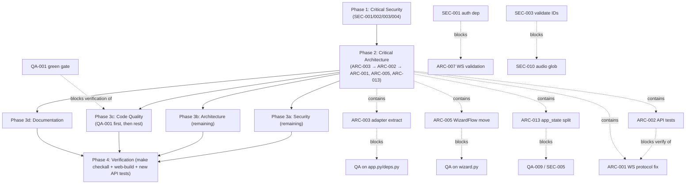

# Project Audit Report

> **Project**: par-storygen — AI-driven Textual TUI choose-your-own-adventure (+ FastAPI server + Next.js web frontend)
> **Date**: 2026-07-16
> **Stack**: Python 3.13 · Textual · pydantic-ai · openai · FastAPI · uvicorn · Next.js 16 / React 19 · uv · hatchling · pyright (strict) · ruff · pytest
> **Audited by**: Claude Code Audit System (4 parallel domain agents + orchestrator)
> **Indexed via**: par-mem (`repo_id="par-storygen"`, 3104 symbols / 2546 files, index current at `f14eedf`)

---

## Executive Summary

**Overall health is split.** The Textual TUI core (`src/storygen`) is genuinely well-engineered: clean `storage → llm + images → pipeline → widgets → screens → app` layering, atomic content-addressed persistence with cumulative versioned save migrations, 769 meaningful (not smoke) tests, near-zero tech-debt markers, and strong secret hygiene on the single-user surface. The **bolted-on web surface** (`src/storygen_api` + `web/`) is the problem — it ships **non-functional against itself** (a three-way WebSocket protocol divergence means streaming narration and choice rendering silently break), has **zero tests**, **no authentication**, **no CI**, and an **SSRF + API-key-exfiltration chain** that becomes remotely exploitable the moment the server is bound beyond loopback (its default is `0.0.0.0`). Separately, the **CI gate is currently red** — verified by the orchestrator as 75 ruff errors + 5 pyright errors — so `make checkall` does not pass.

**Most critical finding**: the unauthenticated FastAPI surface (SEC-001) combined with the settings-driven SSRF/credential-exfiltration chain (SEC-002) and a default `0.0.0.0` bind — an attacker on the same network can wipe saves, burn the victim's LLM/image budget, and capture API keys. **Estimated effort** to clear the top Criticals: ~3–5 focused days (auth + SSRF allowlist + path validation, API test layer, WS protocol fix, lint/typecheck baseline).

**Biggest strength**: the pipeline seam uses Protocol-based dependency inversion (`BeatAgentLike`, `ImageProviderLike`) so neither the TUI nor the API couples to pydantic-ai, and API-key fields are `Field(exclude=True)` so secrets never reach the saved game JSON.

### Issue Count by Severity

| Severity | Architecture | Security | Code Quality | Documentation | Total |
|----------|:-----------:|:--------:|:------------:|:-------------:|:-----:|
| 🔴 Critical | 3 | 2 | 1 | 3 | **9** |
| 🟠 High     | 5 | 2 | 4 | 8 | **19** |
| 🟡 Medium   | 5 | 3 | 4 | 7 | **19** |
| 🔵 Low      | 4 | 4 | 1 | 3 | **12** |
| **Total**   | **17** | **11** | **10** | **21** | **59** |

> **Note on overlaps**: a few findings appear under two domains (e.g. ARC-002 ≡ QA-003 "no API tests"; ARC-010 ≡ DOC-004 "architecture doc missing the web layer"; ARC-007 ⊂ SEC-001 WS-auth). They are listed in each domain for completeness but counted once per domain above; the Remediation Plan consolidates them into single efforts.

---

## 🔴 Critical Issues (Resolve Immediately)

### [SEC-001] No authentication or authorization on the entire FastAPI API
- **Area**: Security
- **Location**: `src/storygen_api/main.py` (app construction — no auth middleware/dependency); every router under `src/storygen_api/routers/`
- **Description**: No `Depends`-based auth, API key, session check, or rate limit anywhere. Every route is fully open — `DELETE /api/games/{id}`, `PUT /api/settings`, cost-incurring `POST /api/characters/{id}/edit-portrait`, `POST /api/wizard/confirm`, `GET /api/games` (reads all user content). The `serve` CLI defaults to `host=0.0.0.0`.
- **Impact**: Any host that can reach port 8000/8101 can read or destroy all game state, exfiltrate the character library, and ring up arbitrary LLM/image bills. CWE-306 / OWASP A01, A07.
- **Remedy**: Add an auth dependency (shared-bearer-token from env, or loopback-only bind by default) before any non-localhost deployment; gate every state-changing and cost-incurring route. Default the bind to `127.0.0.1`.

### [SEC-002] SSRF + API-key exfiltration chain via the unauthenticated settings endpoint
- **Area**: Security
- **Location**: `src/storygen_api/routers/settings.py:76-190` (`PUT /api/settings` accepts arbitrary `base_url`); `src/storygen/llm/provider_factory.py:81-89` (sends the key as `Authorization: Bearer …` to that `base_url`); `src/storygen/config.py:93-118`
- **Description**: `SettingsUpdateRequest` provider fields are `dict[str, object]` with no schema; `base_url`/`api_key` are persisted unchecked (only `http(s)://` prefix is validated). The next LLM/image call sends the user's real API key as a Bearer header to an attacker-controlled URL. Remotely triggerable via SEC-001. CWE-918 / OWASP A10, A01, A02.
- **Impact**: Credential theft of OpenAI/Gemini/ElevenLabs keys plus arbitrary outbound requests.
- **Remedy**: (a) Auth-gate `PUT /api/settings` (SEC-001). (b) Maintain an allowlist of sanctioned provider base URLs. (c) Never trust a user-supplied `api_key` over the configured one without strong auth. (d) Forbid link-local/private IP ranges on user-influenced outbound URLs.

### [SEC-003] Path traversal via unvalidated `game_id` / `node_id` / `char_id` path parameters *(promoted to Phase 1)*
- **Area**: Security (High; promoted to sequential Phase 1 because it overlaps the QA-targeted router files)
- **Location**: `src/storygen/storage/paths.py:70-72` (`game_dir` does raw `games_root() / game_id`); consumed by `routers/games.py`, `routers/images.py`, `routers/tts.py`, `routers/ws.py`. Contrast with the correct pattern already in `storage/library.py:43-58` (`^[0-9a-f]{32}$`).
- **Description**: FastAPI path params capture a single segment, so `game_id=".."` is valid; `game_dir("..")` resolves above `games_root()`. `node_audio_glob` and `node_image_path` then build paths/file-responses from unvalidated IDs.
- **Impact**: Reads of files outside `games_root()` via glob/file-response handlers; breaks the `StaticFiles`-mount assumption. CWE-22 / OWASP A01.
- **Remedy**: Add `_validate_game_id` (uuid4-hex) to `paths.game_dir`/`game_save_file` and `_validate_node_id`/`_validate_char_id` (reject `/ \ .. leading -`), mirroring the existing `library_id` pattern. One-file change in `paths.py`.

### [SEC-004] Internal exception strings leaked to API clients and WebSocket peers *(promoted to Phase 1)*
- **Area**: Security (High; promoted to Phase 1 because the fix overlaps QA-001's B904 sweep on the same router files)
- **Location**: `routers/games.py:192,326,374,398`; `routers/ws.py:79-84` (`{"error": str(exc)}`); `routers/characters.py:216-218,255-257`
- **Description**: Several handlers do `raise HTTPException(500, detail=str(exc))` on a bare `except Exception`, forwarding raw messages — file paths, provider HTTP bodies, pydantic-ai internal errors — to the client; the WS endpoint forwards `str(exc)` for any pipeline failure.
- **Impact**: Information disclosure that aids further exploitation (e.g. leaks configured `base_url`). CWE-209 / OWASP A05.
- **Remedy**: Log full exceptions server-side (`logger.exception(...)`); return a generic `"internal error"` + correlation ID to the client. For WS, send `{"type":"error","code":"internal_error"}`, never `str(exc)`.

### [ARC-001] WebSocket event protocol is broken between server and frontend (three-way divergence)
- **Area**: Architecture
- **Location**: `src/storygen_api/ws.py:51-100`; `src/storygen_api/routers/ws.py:43-88`; `web/src/lib/ws-types.ts:24-72`; `web/src/hooks/useWebSocket.ts:50-114`
- **Description**: Server emits events whose field names match neither the declared TS contract nor what the React hook reads: `narration_delta` sends `{delta}` but the hook reads `msg.text` (→ undefined); `beat_committed` omits `choices[]` so the player can't pick after the first beat; `image_committed` is never emitted; `image_failed` sends `{status}` but the hook reads `msg.error`; `error` events use `{error}` but the contract/hook use `{message}`.
- **Impact**: Real-time narration silently disappears, choices never render, image failures surface no message. The web frontend is effectively dead code with no integration test catching it.
- **Remedy**: Pick one source of truth (the TS contract), update `ws.py::make_callbacks()` to emit the contract's exact fields, add the missing `on_image_committed` callback, emit `error` events with a `message` field, and add a contract test that asserts every broadcast payload validates against a schema generated from `ws-types.ts`.

### [ARC-002] Zero test coverage for the FastAPI layer (~2.6K LOC across 8 routers + session + ws + deps)
- **Area**: Architecture (consolidates with QA-003)
- **Location**: `src/storygen_api/` (entire package); `tests/` (no `test_api_*` / `test_ws*` files)
- **Description**: Every other layer has dedicated unit tests (54 TUI test files). The API has none — which is exactly why ARC-001 and ARC-003 shipped undetected.
- **Impact**: API/web regressions are invisible; every API refactor is silent-risk.
- **Remedy**: Add `tests/unit/test_api_deps.py`, `tests/unit/test_api_ws.py` (broadcast shape vs. declared schema via `TestClient`), `tests/integration/test_api_full_flow.py` (wizard → WS connect → advance → narration deltas → beat_committed), using the existing `_Result`/Fake-agent pattern from `tests/unit/test_pipeline.py`.

### [ARC-003] Adapter and provider-helper block duplicated between TUI and API; copies have already diverged
- **Area**: Architecture
- **Location**: `src/storygen/app.py:66-156` (`_BeatAgentAdapter`, `_SummaryAdapter`, `_IllustrationAdapter`) vs `src/storygen_api/deps.py:34-124` (same three classes); also duplicated `_resolve_fallback_cfg`/`_build_routed_image_provider`/`_build_split_image_provider`
- **Description**: The two adapter blocks were copy-pasted and have drifted: `app.py` uses `result.usage` (property) at three sites while `deps.py` uses `result.usage()` (method call) at the same sites. Only one is correct for the installed pydantic-ai version; the other silently throws inside `contextlib.suppress(Exception)` and usage is never recorded.
- **Impact**: One surface silently drops usage tracking; future pydantic-ai upgrades break one path before the other. DRY/SOLID violation at the pipeline↔agent seam.
- **Remedy**: Extract a single `src/storygen/runtime/adapters.py` (or `llm/adapters.py`) with the three adapters + three provider helpers; both `app.py` and `deps.py` import from it; delete the duplicate bodies.

### [QA-001] CI gate is red — `make checkall` fails on lint and typecheck *(orchestrator-verified)*
- **Area**: Code Quality
- **Location**: `Makefile` (`checkall: fmt lint typecheck test`); offending files across `src/storygen_api/`
- **Description**: **Verified by the orchestrator** — `uv run ruff check .` reports **75 errors**: 45× `B904` (`raise … from err` dropped across the FastAPI routers), 22× `B008` (`Depends()` in argument defaults — a FastAPI idiom misclassified because rule `B` is enabled wholesale with no per-package carve-out), 5× `I001` (import sort), 2× `F401` (unused imports: `os` in `games.py:384`, `OutfitActionRequest` in `images.py:20`), 1× `P035`. `uv run pyright` reports **5 errors**: the two unused imports plus 3 in `routers/presets.py` (raw `dict` return types). Per CLAUDE.md rule §4 / rule 11, the project is not at its declared "production ready" bar.
- **Impact**: `make checkall` is unrunnable green; pre-commit rejects commits; the B904 class is a real debug-quality bug (lost traceback chains in API error paths).
- **Remedy**: Three independent fixes. (a) `uv run ruff check --fix` for the auto-fixable I001/F401 (8 errors). (b) Add `B008` to `[tool.ruff.lint.per-file-ignores]` for `"src/storygen_api/**"` (FastAPI's documented pattern) or migrate to `Annotated[..., Depends(...)]`. (c) Sweep B904 sites to add `from exc`. Fix the 3 `presets.py` return types to `dict[str, Any]`.

### [DOC-001] The `storygen_api` HTTP/WebSocket surface is entirely undocumented
- **Area**: Documentation
- **Location**: `README.md`, `docs/ARCHITECTURE.md`, `CLAUDE.md`, `.env.example` (all missing it)
- **Description**: `pyproject.toml` declares a second console script (`storygen-api`), an `[api]` extra (`fastapi`, `uvicorn[standard]`, `websockets`, `python-multipart`), and ships `src/storygen_api/` (~2,640 LOC, ~40 REST endpoints + `/api/ws/{game_id}`). None of it is mentioned in any user-facing doc; the only design note is an unlinked `docs/subagents/summary_cff1cda7.md`.
- **Impact**: Web/frontend contributors, integrators, and operators have no entry point; the `[api]` extra and `storygen-api` script are undiscoverable; `make api-dev`/`api-prod` are invisible.
- **Remedy**: Add a "Web API (optional)" section to README (install `uv sync --extra api`, `make api-dev` on `:8101`, `/docs` auto-docs, the WS path). Add an "API layer" section to ARCHITECTURE.md. Document the `storygen-api` CLI.

### [DOC-002] The `web/` Next.js frontend is entirely undocumented
- **Area**: Documentation
- **Location**: `README.md`, `docs/ARCHITECTURE.md`, `CLAUDE.md`, `web/README.md`
- **Description**: `web/` is a 32-file Next.js app (routes: `menu`, `wizard`, `play`, `load`, `characters`, `presets`, `settings`, `style-gallery`) — the entire reason the API exists — yet README/ARCHITECTURE/CLAUDE never mention it. `web/README.md` is still unmodified `create-next-app` boilerplate telling readers to use port 3000, while the project runs the web dev server on `:8100` against the API on `:8101`.
- **Impact**: A new contributor cannot tell par-storygen has a web UI; the web README actively misleads (wrong port, generic instructions).
- **Remedy**: Replace `web/README.md` with a project-specific doc (`make web-install`, `make web-dev` → `:8100`, companion API on `:8101`, route map). Add a "Web frontend" subsection to README and ARCHITECTURE.

### [DOC-003] Default character-portrait model has drifted — docs say `gpt-image-1.5`, code says `gpt-image-2`
- **Area**: Documentation
- **Location**: `src/storygen/storage/app_state.py:77` (`DEFAULT_CHARACTER_IMAGE_MODEL = "gpt-image-2"`) vs `README.md` (lines 192, 271, 278, 281), `docs/ARCHITECTURE.md` (117–119, 139, 148), `.env.example:37`, `CLAUDE.md`
- **Description**: Both scene/cover art and character portraits now default to `gpt-image-2` in code, but the docs repeatedly state the portrait default is `gpt-image-1.5` (with a transparent-background rationale that no longer matches the identifier). `.env.example` documents `STORYGEN_CHARACTER_IMAGE_MODEL=gpt-image-1.5`.
- **Impact**: Users following the docs configure the wrong default; pricing/capability reasoning silently diverges; patches re-introduce the drift via CLAUDE.md.
- **Remedy**: **Decide intent first** — should the portrait default be `gpt-image-2` (code) or `gpt-image-1.5` (docs, with the transparency rationale)? Then align all four files. If `gpt-image-2`, also update the transparency rationale (ARCHITECTURE.md:117).

---

## 🟠 High Priority Issues

### Architecture
- **[ARC-004]** API is structurally single-worker (in-memory session/WS/TTS singletons) with no documented guard or runtime check — a second uvicorn worker silently desyncs game state. `src/storygen_api/deps.py:208-225`, `ws.py:103`, `routers/tts.py:13`, `Makefile` (`--workers 1`). Remedy: assert single-worker in `lifespan()` (read `WEB_CONCURRENCY`) and document why; or move session state to Redis.
- **[ARC-005]** `WizardFlow` (a headless state machine used by both TUI and API) lives inside the TUI-only `screens/wizard.py` and is imported across the declared layer boundary by `storygen_api/routers/wizard.py`. Remedy: move it to `src/storygen/runtime/wizard_flow.py`.
- **[ARC-006]** No push/PR CI — the only workflow is a manually-dispatched release; `make checkall` runs only locally via pre-commit, so `--no-verify` commits can land red. Remedy: add `.github/workflows/ci.yml` on `push`+`pull_request` running `make checkall` + `make web-build`, matrixed on Python 3.13/3.14.
- **[ARC-007]** WebSocket endpoint has no auth and no input validation — `choice_id`/`from_node_id` are read from arbitrary JSON and passed unvalidated to `pipeline.advance`. Fold the WS-auth part into SEC-001; add validation against `save` before invoking the pipeline. `routers/ws.py:14-90`.
- **[ARC-008]** `make checkall` runs `fmt` (which mutates files) before the read-only gates, so formatting drift is auto-fixed/masked rather than failing. `Makefile:30`. Remedy: `checkall: lint typecheck test`; keep `fmt` separate (pre-commit already runs it).

### Security
- **[SEC-003]** Path traversal — see Critical (promoted).
- **[SEC-004]** Exception-string info leak — see Critical (promoted).

### Code Quality
- **[QA-002]** Cyclomatic complexity at the Critical (>20) band in core hot-paths: `wizard._advance_worker` cc=34, `play.check_action` cc=31, `pipeline.advance` cc=29, `portraits.on_button_pressed` cc=24, `settings._save_settings` cc=22 — state-machine-as-sequential-`if`s and God-screen dispatchers. Remedy: dispatch tables (`dict[Step, Callable]` / `dict[action, Callable]`) for the wizard/play/settings methods; leave `pipeline.advance`/`_build_beat_prompt` (intrinsic complexity).
- **[QA-003]** `src/storygen_api/` (2.6K LOC, 8 routers) and `web/src/` have zero tests (consolidates with ARC-002/ARC-015). Remedy: add `test_api_games.py` / `test_api_characters.py` via `TestClient` + `xdg_tmp`, starting with the highest-traffic endpoints.
- **[QA-004]** Silent exception swallowing in `pipeline.py` (3 sites: initial-portrait gen `:762-771`, stage-3 image failure `:876`, `await_prefetched :503`) — failures are invisible to operators, violating the documented `notify(...)`/log convention. Remedy: add `_logger.warning(..., exc_info=True)` at each.
- **[QA-005]** 83 broad `except Exception:` sites across 20 files — most are well-formed (`logger.debug(..., exc_info=True)` + `notify`), but the aggregate is hard to audit and drifts toward silent swallowing. Remedy: fix the 3 silent sites first; optionally extract a `_log_and_notify(exc, op)` helper in `screens/_async_utils.py`.

### Documentation
- **[DOC-004]** `docs/ARCHITECTURE.md` is TUI-only and silent on the shipped API/web layer (consolidates with ARC-010). Remedy: add an "API + web layer" section mirroring TUI depth.
- **[DOC-005]** README "Features"/"Where we are" omit shipped v0.4.0 features (Templates/Presets, Recap, Relationship tracking, Style Gallery, Graph prune, dynamic pacing, ref-image library); "Where we're going" still lists Templates/Presets as future. Remedy: add the six features; move Templates/Presets to "Where we are".
- **[DOC-006]** Four broken README TOC anchors: `#openai-text`, `#ollama-text`, `#openai-image`, `#ollama-image` (found via par-mem `find_broken_doc_links`). Remedy: rename headings to `### OpenAI (text)`/`### OpenAI (image)` etc., or retarget the TOC.
- **[DOC-007]** CORS comment in `storygen_api/main.py:38` says `localhost:3000` but `allow_origins` is `:8100`; Makefile uses `:8100`. Remedy: fix the comment to `8100`; align ports.
- **[DOC-008]** README says press `l` to open the Library Browser in the wizard; the actual binding is `Ctrl+L` (`wizard.py:573`). `docs/NEW_STORY_WIZARD.md` is correct. Remedy: change README to `Ctrl+L`.
- **[DOC-009]** `CLAUDE.md` is missing the `api-dev`/`api-prod`/`web-install`/`web-dev`/`web-build` Make targets and the API/web architecture; `grep` for them returns 0. Remedy: extend Commands + Architecture blocks.
- **[DOC-010]** `storygen-api serve` binds `0.0.0.0` by default — undocumented network exposure of the API and its `/api/images` static mount of saved-game images. Remedy: document the default; recommend `--host 127.0.0.1`; consider changing the code default (see SEC-006).
- **[DOC-011]** FastAPI app advertises `version="0.1.0"` while the package is on `0.5.0` (`storygen_api/main.py:33`). Remedy: pass `storygen.__version__` to `FastAPI(version=...)`.

---

## 🟡 Medium Priority Issues

### Architecture
- **[ARC-009]** `WebSocketManager._broadcast` iterates `self._connections` without a lock while `disconnect` may mutate it concurrently (`ws.py:33-46`) — possible mid-iteration `RuntimeError`. Remedy: snapshot the list under an `asyncio.Lock`.
- **[ARC-010]** `docs/ARCHITECTURE.md` documents only the TUI surface (consolidates with DOC-004). Remedy: add a Web/API architecture section.
- **[ARC-011]** `pipeline.py` is a 1042-LOC monolith mixing five responsibilities (advance flow, prefetch lifecycle, portraits, scene rendering, edit/retry) + prompt construction; `advance()` alone is 208 LOC. Remedy: extract pure prompt helpers to `pipeline_prompts.py`; consider a `PrefetchCoordinator` class.
- **[ARC-012]** Four God screens >1000 LOC (`settings.py` 1475, `wizard.py` 1345, `play.py` 1140, `portraits.py` 1106); `SettingsScreen._populate_from_state` fans out to 34 collaborators. Remedy: extract per-section controller classes; screens become thin compose-and-delegate shells. (Consolidates with QA-006.)
- **[ARC-013]** `storage/app_state.py` (730 LOC, 43 functions) is a God module mixing defaults + 5 prefs dataclasses + atomic I/O + ~25 readers/writers. Remedy: split into `app_state/{defaults,models,io}.py` with a back-compat `__init__.py`.

### Security
- **[SEC-005]** API keys persisted in plaintext in `state.json` with no file-mode hardening (`write_app_state` never `os.chmod` — typically `0o644`, world-readable), unlike game dirs (`0o700`) and library files (`0o600`). `app_state.py:284-299`. Remedy: `os.chmod(tmp, 0o600)` before `os.replace`; long-term, prefer OS keychain. CWE-312.
- **[SEC-006]** Server defaults to `host=0.0.0.0` (`main.py:79`), compounding SEC-001. Remedy: default to `127.0.0.1`; require explicit opt-in + auth for non-loopback. CWE-668.
- **[SEC-007]** No rate limiting / quota on cost-incurring LLM/image endpoints (`wizard`, `images`, `characters` portrait-regen, `games` advance/regenerate-node). Remedy: per-IP/per-game concurrency limits (e.g. `slowapi`), a daily ceiling, a configurable spend cap checked before each provider call. CWE-770.

### Code Quality
- **[QA-006]** God-object screens >1000 LOC (consolidates with ARC-012).
- **[QA-007]** Cross-module `_private` imports are misleading tech debt — `_prompts.py`, `_image_util.py`, `_header_util.py` are underscore-prefixed but de-facto public, imported across modules/packages. Remedy: strip the underscore from the 3 public utility modules (or document that `screens/_*` means "screens-internal"). CLAUDE.md confirms `_prompts.py` is canonical, so the prefix is simply wrong.
- **[QA-008]** Legacy `image_cost` shim in `openai_provider.py:49` has a **different signature** from the canonical `pricing.py:162` version — same name, different param order, silent wrong-pricing if the wrong one is imported. Remedy: migrate the 4 callers (pipeline/wizard/portraits) to `pricing.image_cost`, delete the shim + its pin test.
- **[QA-009]** 62 `# type: ignore`/`pyright: ignore` (~30 undocumented) in `preset_picker.py`, `wizard.py`, `app_state.py`, `deps.py`, `main.py` — reaching into app privates or fighting pydantic's typed-dict flow without explaining why. Remedy: add `# pyright: ... - <reason>` to each undocumented site.

### Documentation
- **[DOC-012]** `web/README.md` is unmodified `create-next-app` boilerplate (port 3000, generic `npm run dev`, `app/page.tsx`). Remedy: replace entirely.
- **[DOC-013]** `web/AGENTS.md` (one paragraph) and `web/CLAUDE.md` (single `@AGENTS.md` include) are content-free stubs. Remedy: document the web layout, API client, data flow, lint/build commands.
- **[DOC-014]** `storygen_api` has zero module docstrings (15 files) and zero tests; the WS event schema lives only inside `ws.py` method bodies. Remedy: one-line module docstrings per file; document the WS event contract; add smoke tests.
- **[DOC-015]** Root `AGENTS.md` is a single `read @CLAUDE.md` line with no H1/summary, violating the project's own `DOCUMENTATION_STYLE_GUIDE.md`. Remedy: add `# par-storygen Agent Guide` + one sentence.
- **[DOC-016]** README hotkey inventory is incomplete for shipped features (`f` relationships, `Shift+R` recap, `p` graph prune, `i` info picker all undocumented). Remedy: add a PlayScreen keys table + GraphScreen keys line.
- **[DOC-017]** `.env.example` omits `ELEVENLABS_API_KEY`/`DEEPGRAM_API_KEY` that ARCHITECTURE.md references for TTS. Remedy: add commented examples.
- **[DOC-018]** `docs/subagents/` and `docs/superpowers/specs/` are an undocumented design archive (incl. the only web-architecture write-up). Remedy: add a "Design docs" index; have ARCHITECTURE.md cite `summary_cff1cda7.md`.

---

## 🔵 Low Priority / Improvements

### Architecture
- **[ARC-014]** All 30 Python deps use floating `>=` with no upper bound; `uv.lock` is the only real pin. Remedy (optional): bound high-churn deps (`pydantic-ai`, `textual`, `openai`) to `>=X,<MAJOR+1`.
- **[ARC-015]** `web/` frontend has zero tests (consolidates with QA-003). Remedy: vitest + jsdom for `useWebSocket` against canned payloads; one Playwright e2e.
- **[ARC-016]** Hardcoded ports/origins scattered across `web/src/lib/api.ts`, `useWebSocket.ts`, `game-store.ts`, `main.py` CORS, `Makefile`. Remedy: single `NEXT_PUBLIC_API_BASE` env consumed via one TS module.
- **[ARC-017]** par-mem `find_bridge_symbols`/`get_symbol_context` reported `TTSPlayer::pause` as a top-1 bridge symbol (in_degree 215) then "not found" on lookup — tooling friction, **filed to `~/Repos/PAR-MEM-FEEDBACK.md`** by the architecture agent. Not a project defect; no code change.

### Security
- **[SEC-008]** CORS port mismatch (`main.py` allows `:8100`; `web/src/lib/api.ts` uses `:8101`; `serve` default is `:8000`) + permissive `allow_methods`/`allow_headers = ["*"]`. Remedy: align on one port; tighten methods/headers.
- **[SEC-009]** Book-export download filename built from an LLM-generated `theme.title` without `sanitize_title` on the API path (`games.py:405`). Defense-in-depth (Starlette escapes `Content-Disposition`). Remedy: reuse `export/book.py::sanitize_title`.
- **[SEC-010]** `node_audio_glob` interpolates `node_id` into a glob pattern (`paths.py:253`); mitigated once SEC-003 validates `node_id`. Remedy: folded into SEC-003.
- **[SEC-011]** WebSocket has no origin check and no message-size cap (`ws.py`, `routers/ws.py`). Remedy: add origin allowlist + `receive_json` size cap alongside the auth rollout.

### Code Quality
- **[QA-010]** 5 `I001` import-sort violations (auto-fixable, folded into QA-001) and minor readability nits (`_PACING_OPTIONS` rebuilt inside `_advance_worker` instead of module-level).

### Documentation
- **[DOC-019]** README badges omit CI/coverage. Remedy: add a GitHub Actions badge (once ARC-006 CI lands).
- **[DOC-020]** Docstring coverage ~59% in `src/storygen` with gaps on headline symbols (`StoryGenApp`, `pipeline.run`/`generate_portrait`/`generate_scene`). Remedy: class-level docstrings on those.
- **[DOC-021]** `pyproject.toml` Documentation URL points at the README blob; once DOC-001 lands, consider pointing at a docs index that includes the API reference.

---

## Detailed Findings

### Architecture & Design

The TUI core is a well-layered, content-addressed, atomic-write engine with proper Protocol-based dependency inversion at the pipeline boundary. The web surface reuses the TUI internals correctly at the storage/llm/images layers, but reaches into `screens/` for headless logic, copy-pastes the TUI's adapter block (which has already diverged into a silent bug), ships with zero tests, and emits WebSocket events that match neither its declared TypeScript contract nor what the React consumer reads.

- **Critical**: ARC-001 (WS protocol divergence), ARC-002 (zero API tests), ARC-003 (adapter duplication + divergence).
- **High**: ARC-004 (single-worker undocumented), ARC-005 (`WizardFlow` in `screens/`), ARC-006 (no CI), ARC-007 (WS no auth/validation), ARC-008 (`checkall` runs `fmt`).
- **Medium**: ARC-009 (broadcast race), ARC-010 (arch doc missing web), ARC-011 (`pipeline.py` monolith), ARC-012 (God screens), ARC-013 (`app_state.py` God module).
- **Low**: ARC-014 (floating deps), ARC-015 (web zero tests), ARC-016 (hardcoded ports), ARC-017 (par-mem friction — external).

**Key concern**: the web frontend and API are non-functional against each other (ARC-001) and there is no test (ARC-002) or CI gate (ARC-006) to catch it — the dual surface is currently an architectural façade rather than a working second entry point.

### Security Assessment

The FastAPI surface has **no authentication or authorization on any route**, which is the dominant risk; every other API-layer finding amplifies it. The TUI surface is comparatively well-hardened: secret scanning in pre-commit, `Field(exclude=True)` on API-key fields (so keys never reach saved game JSON), `safe_join` traversal guards on nested paths, list-form subprocess (no `shell=True`), Jinja2 autoescape, atomic writes with restrictive modes on game directories, `library_id` uuid validation, and `react-markdown` without `rehype-raw` (no XSS via narration). The same rigor was **not** applied to `game_id`/`node_id`/`char_id` path params, and the server binds `0.0.0.0` with no auth.

- **Critical**: SEC-001 (no API auth), SEC-002 (SSRF + key-exfil chain).
- **High** (promoted to Phase 1): SEC-003 (path traversal), SEC-004 (info leak).
- **Medium**: SEC-005 (plaintext keys / no chmod), SEC-006 (`0.0.0.0` default), SEC-007 (no rate limiting).
- **Low**: SEC-008 (CORS mismatch), SEC-009 (export filename), SEC-010 (audio glob), SEC-011 (WS origin/size).

**Highest risk**: the unauthenticated FastAPI surface — `0.0.0.0` bind + no auth + settings-driven SSRF/credential-exfiltration — must be resolved before the server is exposed beyond loopback. **Grade separately**: Critical when the FastAPI server is deployed; Strong for the single-user TUI.

### Code Quality

The architecture is sound, conventions are documented and largely followed, tests are meaningful, and the Python-specific anti-patterns that trip most projects (mutable defaults, sync-in-async, blocking I/O on the event loop) are entirely absent. The headline problem is that **the CI gate is red** (QA-001, orchestrator-verified: 75 lint + 5 typecheck), which both violates the project's stated "production ready" bar and masks a real debug-quality bug class (50+ B904 violations lose traceback chains in API error paths).

- **Critical**: QA-001 (lint/typecheck baseline red — verified).
- **High**: QA-002 (complexity hotspots), QA-003 (no API/web tests), QA-004 (silent exception swallowing), QA-005 (broad-except aggregate debt).
- **Medium**: QA-006 (God screens), QA-007 (`_private` cross-module imports), QA-008 (`image_cost` shim footgun), QA-009 (undocumented `type: ignore`).
- **Low**: QA-010 (import-sort + minor constants).

**Tech-debt markers**: 1 TODO/FIXME across 20K LOC (and it's a doc example) — exceptionally clean. 769 tests pass in ~69s with meaningful assertions; coverage is good (>70%) for `src/storygen/` but zero for `src/storygen_api/` and `web/`.

### Documentation Review

The TUI side is well documented (README, ARCHITECTURE.md, CLAUDE.md, NEW_STORY_WIZARD.md, ~59% docstring coverage form a coherent onboarding path). The shipped FastAPI server and Next.js frontend have effectively zero user-facing documentation, several recently shipped v0.4.0 features are missing from the README (and one is wrongly listed as future), and there is a high-impact accuracy drift around the default character-portrait model.

- **Critical**: DOC-001 (API undocumented), DOC-002 (web undocumented), DOC-003 (image-default drift).
- **High**: DOC-004 (ARCHITECTURE.md TUI-only), DOC-005 (README omits v0.4.0 features), DOC-006 (4 broken TOC anchors), DOC-007 (CORS comment wrong), DOC-008 (`l` vs `Ctrl+L`), DOC-009 (CLAUDE.md missing API/web), DOC-010 (`0.0.0.0` undocumented), DOC-011 (FastAPI version `0.1.0`).
- **Medium**: DOC-012 (web/README boilerplate), DOC-013 (web AGENTS/CLAUDE stubs), DOC-014 (storygen_api zero docstrings/tests), DOC-015 (AGENTS.md style violation), DOC-016 (README hotkey inventory), DOC-017 (.env.example missing TTS keys), DOC-018 (design archive undocumented).
- **Low**: DOC-019 (no CI badge), DOC-020 (docstring gaps), DOC-021 (pyproject doc URL).

**Most impactful gap**: the entire `storygen_api` + `web/` surface ships in the package but has zero user-facing documentation, including an undocumented `0.0.0.0` default and a CORS comment naming the wrong port.

---

## Remediation Roadmap

### Immediate Actions (Before any non-localhost API deployment)
1. **SEC-001 + SEC-002**: auth-gate the API and add a provider base-URL allowlist (kills the SSRF/credential-exfil chain). Default bind to `127.0.0.1`.
2. **SEC-003 + SEC-004**: validate `game_id`/`node_id`/`char_id` (one-file `paths.py` change) and stop leaking `str(exc)` to clients.
3. **QA-001**: restore the green gate (`ruff --fix` + `B008` per-file-ignore + B904 sweep + `presets.py` return types) — unblocks all other verification.
4. **ARC-001 + ARC-002**: add the API test layer, then fix the WS protocol against a single source of truth.

### Short-term (Next 1–2 Sprints)
1. **ARC-003**: extract the shared adapter module (eliminate the silent usage-tracking divergence).
2. **ARC-006 + ARC-008**: add push/PR CI; split `fmt` out of `checkall`.
3. **ARC-005 + ARC-013**: move `WizardFlow` to `runtime/`; split `app_state.py` (unblocks screen/storage cleanup).
4. **SEC-005/006/007**: harden `state.json` file mode, fix the `0.0.0.0` default, add rate limiting.
5. **DOC-001/002/004/009**: document the API + web surface in README, ARCHITECTURE.md, CLAUDE.md.

### Long-term (Backlog)
1. **ARC-011 + ARC-012 + QA-002/006**: split `pipeline.py` and decompose the God screens (dispatch tables + per-section controllers).
2. **QA-007/008/009**: rename `_private` utility modules, remove the `image_cost` shim, document `type: ignore` sites.
3. **ARC-014/015/016**: bound high-churn deps, add web tests, centralize port/origin config.
4. **DOC-014/016/017/018 + remaining**: complete API docstrings, README hotkey table, `.env.example` TTS keys, design-doc index.

---

## Positive Highlights

1. **Clean TUI layering** — `grep -rn "from storygen_api" src/storygen/` returns zero hits; lower layers genuinely never import higher ones.
2. **Protocol-based dependency inversion at the pipeline seam** — `BeatAgentLike`, `IllustrationAgentLike`, `SummaryAgentLike`, `ImageProviderLike` let both surfaces inject pydantic-ai adapters without the pipeline importing pydantic-ai.
3. **Atomic, content-addressed game-state tree** — `.tmp + os.replace` JSON writes, cumulative versioned save migrations, frozen node identity enabling byte-for-byte replay.
4. **Strong secret hygiene on the TUI surface** — `.env` gitignored and untracked, `gitleaks`+`detect-private-key` pre-commit, API-key fields `Field(exclude=True)` (verified absent from `game.json`), `safe_join` traversal guards, `library_id` uuid validation, list-form subprocess (no `shell=True`), Jinja2 autoescape, and `react-markdown` without `rehype-raw`.
5. **Restrictive file modes** — game directories `chmod 0o700`, library files `chmod 0o600`, atomic writes throughout (`save_game`, `_atomic_write_png`, `save_library_character`, `write_app_state`).
6. **Near-zero tech-debt markers** — 1 TODO across 20K LOC, and it's a documentation example.
7. **Clean of common Python footguns** — no mutable default arguments, no synchronous/blocking calls inside async functions.
8. **Exemplary prefetch pipeline** — idempotent task registry, per-key failure dedupe, a semaphore for LLM-call throttling, defense-in-depth cancellation, with the "prefetch must never surface errors to the UI" contract documented inline.
9. **Deep, accurate TUI documentation** — `ARCHITECTURE.md` and `CHANGELOG.md` are written for a maintainer who needs to act, plus a genuinely useful `DOCUMENTATION_STYLE_GUIDE.md`.
10. **769 meaningful tests passing** — real `FakeBeatAgent`/`FakeImageProvider` fixtures with `xdg_tmp` isolation, not smoke tests; assertion density ~3/test.

---

## Audit Confidence

| Area | Files Reviewed | Confidence |
|------|---------------|-----------|
| Architecture | ~30 (storygen_api/*, pipeline, screens, app, storage, pyproject, Makefile, web/*) | **High** — concrete file:line evidence; ARC-001 verified across every `send_json` site |
| Security | ~25 (routers/*, storage/*, llm, config, export, web, pyproject) | **High** — exploit chains traced; `.env` git-tracking verified by orchestrator |
| Code Quality | ~40 (all of src/ + tests/) | **High** — QA-001 independently re-verified by orchestrator (75 lint + 5 typecheck) |
| Documentation | ~25 (all docs/ + source docstrings) | **High** — par-mem `find_broken_doc_links` confirmed broken anchors; code-vs-doc drift spot-checked |

*par-mem served the architecture, documentation, and code-quality agents cleanly (index current at `f14eedf`). One friction item (`TTSPlayer::pause` false bridge-symbol) was filed to `~/Repos/PAR-MEM-FEEDBACK.md` — see ARC-017.*

---

## Remediation Plan

> Generated by the audit and consumed directly by `/fix-audit`. Pre-computes phase assignments and file conflicts so the fix orchestrator can proceed without re-analyzing the codebase.

### Phase Assignments

#### Phase 1 — Critical Security (Sequential, Blocking)
<!-- Critical Security issues, plus High Security issues promoted here due to file conflicts with Code Quality (QA-001's B904 sweep touches the same router files). Severity may therefore be lower than Critical for promoted rows. -->
| ID | Title | File(s) | Severity |
|----|-------|---------|----------|
| SEC-001 | No auth/authorization on entire FastAPI API | `src/storygen_api/main.py`, `src/storygen_api/routers/*` | Critical |
| SEC-002 | SSRF + API-key exfiltration via unauth settings | `src/storygen_api/routers/settings.py`, `src/storygen/llm/provider_factory.py`, `src/storygen/config.py` | Critical |
| SEC-003 | Path traversal via unvalidated IDs *(promoted — conflicts with QA-001 routers)* | `src/storygen/storage/paths.py` (+router consumption) | High |
| SEC-004 | Internal exception strings leaked *(promoted — conflicts with QA-001 B904 sweep)* | `src/storygen_api/routers/games.py`, `routers/characters.py`, `routers/ws.py` | High |

#### Phase 2 — Critical Architecture (Sequential, Blocking)
<!-- Issues that restructure the codebase; must complete before the Code Quality fixes that depend on them. -->
| ID | Title | File(s) | Severity | Blocks |
|----|-------|---------|----------|--------|
| ARC-003 | Extract shared adapter/provider-helper module | new `src/storygen/runtime/adapters.py`, `src/storygen/app.py`, `src/storygen_api/deps.py` | Critical | QA-006 (app.py), QA-009 (deps.py) |
| ARC-002 | Add FastAPI test layer (consolidates QA-003) | new `tests/unit/test_api_deps.py`, `test_api_ws.py`, `tests/integration/test_api_full_flow.py` | Critical | ARC-001 (verification) |
| ARC-001 | Fix WebSocket event protocol (3-way divergence) | `src/storygen_api/ws.py`, `routers/ws.py`, `web/src/lib/ws-types.ts`, `web/src/hooks/useWebSocket.ts` | Critical | web/ real-time feature work |
| ARC-005 | Move `WizardFlow` out of `screens/` *(promoted)* | new `src/storygen/runtime/wizard_flow.py`, `screens/wizard.py`, `api/routers/wizard.py` | High | QA-002/QA-007 (wizard.py) |
| ARC-013 | Split `app_state.py` God module *(promoted)* | `src/storygen/storage/app_state.py` → `app_state/{defaults,models,io}.py` | Medium | QA-009 (app_state.py), SEC-005 |

#### Phase 3 — Parallel Execution
<!-- All remaining work, safe to run concurrently by domain. Fix agents MUST read current file state before editing conflict files (see File Conflict Map). -->

**3a — Security (remaining)**
| ID | Title | File(s) | Severity |
|----|-------|---------|----------|
| SEC-005 | Plaintext keys / no `chmod` on `state.json` | `src/storygen/storage/app_state.py` | Medium |
| SEC-006 | Default bind `0.0.0.0` | `src/storygen_api/main.py` | Medium |
| SEC-007 | No rate limiting on cost-incurring endpoints | `src/storygen_api/routers/wizard.py`, `images.py`, `characters.py`, `games.py` | Medium |
| SEC-008 | CORS port mismatch + permissive policy | `src/storygen_api/main.py`, `web/src/lib/api.ts` | Low |
| SEC-009 | Export filename from LLM title | `src/storygen_api/routers/games.py`, `src/storygen/export/book.py` | Low |
| SEC-010 | `node_audio_glob` user-influenced value | `src/storygen/storage/paths.py` | Low |
| SEC-011 | WS no origin check / no msg-size cap | `src/storygen_api/ws.py`, `routers/ws.py` | Low |

**3b — Architecture (remaining)**
| ID | Title | File(s) | Severity |
|----|-------|---------|----------|
| ARC-004 | Single-worker in-memory singletons, no guard | `src/storygen_api/main.py`, `session.py`, `routers/tts.py`, `Makefile` | High |
| ARC-006 | No push/PR CI | new `.github/workflows/ci.yml` | High |
| ARC-007 | WS input validation (auth arm folded into SEC-001) | `src/storygen_api/routers/ws.py` | High |
| ARC-008 | `checkall` runs `fmt` (mutates) before gates | `Makefile` | High |
| ARC-009 | `_broadcast` mutates `_connections` without lock | `src/storygen_api/ws.py` | Medium |
| ARC-010 | ARCHITECTURE.md TUI-only (≡ DOC-004) | `docs/ARCHITECTURE.md` | Medium |
| ARC-011 | `pipeline.py` 1042-LOC monolith | `src/storygen/pipeline.py` | Medium |
| ARC-012 | Four >1000-LOC God screens (≡ QA-006) | `src/storygen/screens/{settings,wizard,play,portraits}.py` | Medium |
| ARC-014 | Floating deps, no upper bound | `pyproject.toml` | Low |
| ARC-015 | web/ zero tests (≡ QA-003) | `web/` | Low |
| ARC-016 | Hardcoded ports/origins | `web/src/lib/api.ts`, `web/src/stores/game-store.ts`, `web/src/hooks/useWebSocket.ts`, `src/storygen_api/main.py` | Low |
| ARC-017 | par-mem friction (external — no code change) | `~/Repos/PAR-MEM-FEEDBACK.md` | Low |

**3c — Code Quality (all)** *(must land after QA-001 restores the green gate; refactors after ARC-003/005/013 + QA-003)*
| ID | Title | File(s) | Severity |
|----|-------|---------|----------|
| QA-001 | Lint/typecheck baseline red (verified) | `pyproject.toml`, `src/storygen_api/routers/*`, `main.py`, `deps.py`, `schemas.py` | Critical |
| QA-002 | Cyclomatic complexity hotspots | `screens/wizard.py`, `screens/play.py`, `pipeline.py`, `screens/portraits.py`, `screens/settings.py` | High |
| QA-003 | No API/web tests (≡ ARC-002/015) | `tests/unit/test_api_*.py` (new) | High |
| QA-004 | Silent exception swallowing | `src/storygen/pipeline.py` | High |
| QA-005 | Broad `except Exception` aggregate | `src/storygen/pipeline.py`, `screens/*` | High |
| QA-006 | God-object screens >1000 LOC (≡ ARC-012) | `src/storygen/screens/*` | Medium |
| QA-007 | Cross-module `_private` imports | `images/_prompts.py`, `widgets/_image_util.py`, `widgets/_header_util.py` | Medium |
| QA-008 | Legacy `image_cost` shim footgun | `images/openai_provider.py`, `images/pricing.py` | Medium |
| QA-009 | Undocumented `# type: ignore` | `screens/preset_picker.py`, `screens/wizard.py`, `storage/app_state.py`, `api/deps.py`, `api/main.py` | Medium |
| QA-010 | Import-sort + minor constants | `src/storygen_api/schemas.py`, `screens/graph.py`, `screens/wizard.py` | Low |

**3d — Documentation (all)**
| ID | Title | File(s) | Severity |
|----|-------|---------|----------|
| DOC-001 | API surface undocumented | `README.md`, `docs/ARCHITECTURE.md`, `CLAUDE.md`, `.env.example` | Critical |
| DOC-002 | web/ frontend undocumented | `README.md`, `docs/ARCHITECTURE.md`, `CLAUDE.md`, `web/README.md` | Critical |
| DOC-003 | Image-default drift (decide intent first) | `README.md`, `docs/ARCHITECTURE.md`, `.env.example`, `CLAUDE.md` | Critical |
| DOC-004 | ARCHITECTURE.md TUI-only (≡ ARC-010) | `docs/ARCHITECTURE.md` | High |
| DOC-005 | README omits shipped v0.4.0 features | `README.md` | High |
| DOC-006 | Four broken README TOC anchors | `README.md` | High |
| DOC-007 | CORS comment wrong | `src/storygen_api/main.py` | High |
| DOC-008 | README `l` vs actual `Ctrl+L` | `README.md`, `docs/NEW_STORY_WIZARD.md` | High |
| DOC-009 | CLAUDE.md missing API/web | `CLAUDE.md` | High |
| DOC-010 | `0.0.0.0` default undocumented | `README.md`, `CLAUDE.md`, `src/storygen_api/main.py` | High |
| DOC-011 | FastAPI `version=0.1.0` vs `0.5.0` | `src/storygen_api/main.py` | High |
| DOC-012 | web/README boilerplate | `web/README.md` | Medium |
| DOC-013 | web/AGENTS.md + web/CLAUDE.md stubs | `web/AGENTS.md`, `web/CLAUDE.md` | Medium |
| DOC-014 | storygen_api zero docstrings/tests | `src/storygen_api/**/*.py` | Medium |
| DOC-015 | Root AGENTS.md style violation | `AGENTS.md` | Medium |
| DOC-016 | README hotkey inventory incomplete | `README.md` | Medium |
| DOC-017 | .env.example missing TTS keys | `.env.example` | Medium |
| DOC-018 | Design archive undocumented | `docs/ARCHITECTURE.md`, `docs/subagents/*`, `docs/superpowers/specs/*` | Medium |
| DOC-019 | No CI/coverage badge | `README.md` | Low |
| DOC-020 | Docstring gaps on headline symbols | `src/storygen/app.py`, `src/storygen/pipeline.py` | Low |
| DOC-021 | pyproject Documentation URL | `pyproject.toml` | Low |

### File Conflict Map
<!-- Files touched by issues in multiple domains. Fix agents MUST read current file state before editing — a prior agent may have already changed these. -->

| File | Domains | Issues | Risk |
|------|---------|--------|------|
| `src/storygen_api/main.py` | Security + Architecture + Code Quality + Documentation | SEC-001, SEC-006, SEC-008, ARC-004, ARC-007, ARC-016, QA-001, DOC-007, DOC-010, DOC-011 | ⚠️ **High — read before edit** |
| `src/storygen_api/routers/games.py` | Security + Architecture + Code Quality + Documentation | SEC-001, SEC-003, SEC-004, SEC-007, SEC-009, ARC-007, QA-001, QA-003, DOC-014 | ⚠️ **High** |
| `src/storygen_api/routers/wizard.py` | Security + Architecture + Code Quality + Documentation | SEC-001, SEC-002, SEC-007, ARC-005, QA-001, QA-003, DOC-014 | ⚠️ **High** |
| `src/storygen_api/routers/ws.py` | Architecture + Security + Documentation | ARC-001, ARC-007, SEC-001, SEC-004, SEC-011, DOC-014 | ⚠️ **High** |
| `src/storygen_api/routers/characters.py` | Security + Code Quality + Documentation | SEC-001, SEC-004, SEC-007, QA-001, QA-003, DOC-014 | ⚠️ **High** |
| `src/storygen_api/routers/images.py` | Security + Code Quality + Documentation | SEC-001, SEC-003, SEC-007, QA-001, QA-003, DOC-014 | Medium |
| `src/storygen_api/routers/tts.py` | Security + Architecture + Documentation | SEC-001, SEC-003, SEC-007, ARC-004, DOC-014 | Medium |
| `src/storygen_api/ws.py` | Architecture + Security + Documentation | ARC-001, ARC-009, SEC-011, DOC-014 | Medium |
| `src/storygen_api/deps.py` | Architecture + Code Quality | ARC-003, ARC-004, QA-001, QA-009 | Medium |
| `src/storygen_api/routers/settings.py` | Security + Documentation | SEC-002, DOC-014 | Low |
| `src/storygen/storage/app_state.py` | Architecture + Security + Code Quality | ARC-013, SEC-005, QA-009 | ⚠️ **High — ARC-013 split lands first (Phase 2)** |
| `src/storygen/screens/wizard.py` | Architecture + Code Quality | ARC-005, ARC-012, QA-002, QA-007 | Medium |
| `src/storygen/pipeline.py` | Architecture + Code Quality | ARC-011, QA-002, QA-004, QA-005 | Medium |
| `src/storygen/app.py` | Architecture + Code Quality + Documentation | ARC-003, QA-006, DOC-020 | Medium |
| `docs/ARCHITECTURE.md` | Architecture + Documentation | ARC-010, DOC-001, DOC-003, DOC-004, DOC-018 | Medium |
| `CLAUDE.md` | Documentation (+ referenced by all agents) | DOC-001, DOC-002, DOC-003, DOC-009, DOC-010 | Medium |
| `pyproject.toml` | Code Quality + Architecture + Documentation | QA-001, ARC-014, DOC-021 | Medium |
| `Makefile` | Architecture | ARC-004, ARC-008 | Low |
| `web/src/lib/api.ts` | Architecture + Security | ARC-016, SEC-008 | Low |
| `src/storygen/storage/paths.py` | Security | SEC-003, SEC-010 | Low |

*Unlisted files (e.g. most `README.md`-only doc fixes, new test/CI files) have no cross-domain conflicts.*

### Blocking Relationships
<!-- Explicit dependency declarations from audit agents. Format: [blocker] → [blocked] — reason -->
- **QA-001 → QA-002 / QA-003 / QA-004 / QA-005 (and all QA verification)**: the green gate must be restored first — 75 lint + 5 typecheck errors currently bury every other QA finding's verification in noise. The B008 carve-out and B904 sweep must precede new router work and QA-003 (so tests are written against the corrected `raise … from err` shape).
- **ARC-003 → QA-006 (app.py) / QA-009 (deps.py)**: the adapter block must be extracted to `runtime/adapters.py` first; otherwise in-place cleanup is done twice and the `result.usage` vs `result.usage()` divergence recurs.
- **ARC-005 → QA-002 / QA-007 (wizard.py)**: `WizardFlow` must move out of `screens/` before screen-level cleanup, or the API keeps depending on a Textual-coupled module.
- **ARC-013 → QA-009 / SEC-005 (app_state.py)**: the God-module split must land before per-section cleanups and the `chmod` change, or merge conflicts are guaranteed.
- **ARC-002 → ARC-001**: the protocol fix needs the API test layer to verify it. (ARC-002 and QA-003 are the same effort — one body of test work.)
- **ARC-001 → web/ real-time feature work**: the protocol is broken; features built on `useWebSocket.ts` inherit undefined-field reads.
- **SEC-001 → ARC-007**: the auth dependency (`GameAccess`) must exist before ARC-007's WS input validation can reuse it. Fold the WS-auth arm of ARC-007 into the SEC-001 rollout.
- **SEC-003 → SEC-010**: validating `node_id` to a uuid/hex shape prevents glob metacharacters from ever reaching `node_audio_glob`.
- **ARC-008 → QA-001 reliability**: `checkall` running `fmt` mutates the tree and masks failures — split `fmt` out so the gate is read-only.
- **DOC-003 → DOC-003's own fix**: decide code-vs-docs intent (`gpt-image-2` vs `gpt-image-1.5`) before editing — the fix inverts depending on the answer, and the transparency-param note (ARCHITECTURE.md:117) makes this more than a mechanical rename.
- **DOC-007 → DOC-002 → DOC-010**: sequence the CORS-comment fix → web README → host/port documentation so the documented port/host match the runtime.

*No other explicit blocking relationships were identified. ARC-004/SEC-006/DOC-010 (the `0.0.0.0` + single-worker cluster) are coupled but not strictly blocking — fix the host default and document it together.*

### Dependency Diagram

