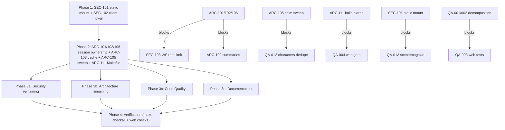

# Project Audit Report

> **Project**: par-storygen
> **Date**: 2026-07-16
> **Stack**: Python 3.13 (Textual TUI + FastAPI, uv/pyright-strict/ruff/pytest) · TypeScript (Next.js 15 + Zustand, vitest/Playwright)
> **Audited by**: Claude Code Audit System (Fable subagents, par-mem graph-assisted, index @ b30f26c)

---

## Executive Summary

The codebase is in good overall health: the Python side (TUI + API) is genuinely excellent — `make checkall` is green end-to-end (ruff clean, pyright strict clean, 908/908 tests), layering is verified-enforced, and the recent security remediation (SEC-001…011) held up under adversarial re-review. The most critical finding is an API-surface state-ownership bug (ARC-101): the cached pipeline's usage callback closes over a stale `GameSave` while routers reload fresh copies per request, silently losing usage/cost data and opening a save-reversion crash window — compounded by no per-game advance serialization (ARC-102). The highest-risk security gap is an unauthenticated `StaticFiles` mount that serves the entire `games_root` tree (including `game.json` and the LLM cache), bypassing the bearer-token gate (SEC-101). Remediating the Critical + High set is roughly 3–5 focused sessions; the dominant theme is that nearly all remaining debt lives in the web surface and the API session layer, while the core TUI/storage/pipeline architecture is a genuine strength.

### Issue Count by Severity

| Severity | Architecture | Security | Code Quality | Documentation | Total |
|----------|:-----------:|:--------:|:------------:|:-------------:|:-----:|
| 🔴 Critical | 1 | 0 | 0 | 0 | **1** |
| 🟠 High     | 2 | 2 | 4 | 2 | **10** |
| 🟡 Medium   | 7 | 1 | 7 | 8 | **23** |
| 🔵 Low      | 5 | 4 | 6 | 5 | **20** |
| **Total**   | **15** | **7** | **17** | **15** | **54** |

**Cross-domain merges** (deduplicated in the counts above): the web bearer-token gap was found independently by Security and Code Quality → **SEC-102** (QA-005 retired). The God-component findings from Architecture (ARC-104) are tracked as **QA-001/QA-002/QA-009**. `BeatPipeline.advance` complexity (QA-008) is tracked as **ARC-110**. The Makefile gate findings are split: fresh-checkout build = **ARC-111**, web gate wiring = **QA-004**.

---

## 🔴 Critical Issues (Resolve Immediately)

### [ARC-101] Stale-save closure aliasing in the API pipeline — usage/cost data silently lost, save-reversion crash window
- **Area**: Architecture
- **Location**: `src/storygen_api/deps.py:54-56` (`_on_usage` closure), `src/storygen_api/routers/games.py:188-219`, `src/storygen_api/routers/ws.py:148`
- **Description**: `deps.build_pipeline` creates `_on_usage` closing over the `GameSave` passed at pipeline construction. The pipeline is cached in `PipelineSessionManager` across requests, but `advance_game` and the WS loop reload a fresh save from disk each request and pass that new object to `pipeline.advance(save, ...)`. From the second advance onward, the usage callback mutates and persists the stale construction-time object while the pipeline commits the beat into the fresh one. (The TUI's identical pattern in `app.py:_start_game` is safe only because the TUI never reloads the save mid-session.)
- **Impact**: (1) API-side token/cost accounting silently loses every request after the first — the stale object's usage is overwritten by the final `save_game` of the fresh object. (2) Mid-advance, `save_game(stale)` writes an old tree snapshot to disk before the new node commits; a crash or interleaved write in that window reverts mutations from other routes (scene edits, portrait updates).
- **Remedy**: Make usage recording save-relative, not closure-captured: pass the advancing save into `on_usage(save, usage)` (adapter signature change), or record usage inside `BeatPipeline.advance` against its `save` argument and drop the closure. Best fixed together with ARC-102/ARC-106 as one "session manager owns the live save + per-game lock" change.

---

## 🟠 High Priority Issues

### [SEC-101] Unauthenticated static mount serves the entire `games_root` tree, bypassing the bearer gate
- **Area**: Security (CWE-284 / OWASP A01)
- **Location**: `src/storygen_api/main.py:117-124`
- **Description**: `app.mount("/api/images", StaticFiles(directory=str(games_root())))` has no `verify_token` dependency. The `images`/`tts` routers carefully gate their read endpoints, but the mount catches every other path under `/api/images/*` and serves it off disk. Because `games_root()` is the parent of every per-game directory, `/api/images/<game_id>/game.json` returns the full save (narration, backstories, `text_config`/`image_config` provider + model + base_url), and `/api/images/<game_id>/llm/...` returns the raw LLM-exchange cache. Router-gated scene PNGs and TTS MP3s are also reachable here unauthenticated.
- **Impact**: An operator who exposes the API on a LAN with `STORYGEN_API_TOKEN` set expects auth to gate content; an unauthenticated peer can download every game's save and LLM cache. The token protects the routers but not the side-door.
- **Remedy**: Do not mount the broad `games_root`. Serve images/audio exclusively through the existing token-gated router endpoints, or mount a token-checking sub-app pointed at a directory that never contains `game.json`/`llm/`.

### [SEC-102] Web frontend never attaches the bearer token — auth-enabled deployments break the client entirely
- **Area**: Security / Code Quality (CWE-306; merges QA-005)
- **Location**: `web/src/lib/api.ts:255-293` (fetch wrappers), `web/src/hooks/useWebSocket.ts:26`
- **Description**: The server supports `Authorization: Bearer` and a `Sec-WebSocket-Protocol: bearer.<token>` handshake built specifically for browsers (`ws.py:61-64`), but no code in `web/src` reads or sends a token — grep finds zero matches. With a token configured, every REST call 401s and the WS handshake is refused (4403).
- **Impact**: The web UI only works with the token unset (loopback-trust mode) — steering operators toward running with auth disabled, which is exactly the configuration SEC-101 makes dangerous. The server-side auth work is unreachable from its intended consumer.
- **Remedy**: Add optional token plumbing in `web/src/lib/config.ts` (e.g. `NEXT_PUBLIC_API_TOKEN`), inject the `Authorization` header in the `api.ts` wrappers, and pass `["bearer." + token]` as the WebSocket subprotocol. Opt-in, never auto-generate tokens; flag for manual security review per repo policy.

### [ARC-102] No per-game serialization of `advance` on the API surface
- **Area**: Architecture
- **Location**: `src/storygen_api/routers/games.py:180-226`, `src/storygen_api/routers/ws.py:133-214`, `src/storygen_api/session.py`
- **Description**: Nothing prevents two concurrent advances for the same `game_id` (REST double-click, or REST + WS). Each request loads its own disk copy, mutates it, and persists whole-file last-writer-wins. `BeatPipeline` has no internal lock; the TUI serializes via `_loading`, the API has no equivalent.
- **Impact**: Concurrent advances commit children into different in-memory copies; the loser's node vanishes from disk while its client navigates from it — 400s/desync. Costs double-incurred for the same pick.
- **Remedy**: Per-game `asyncio.Lock` in `PipelineSessionManager` acquired around load→advance→persist in both REST and WS paths. Design together with ARC-101/ARC-106.

### [ARC-103] `get_app_config` is `lru_cache`d and never invalidated after settings updates
- **Area**: Architecture
- **Location**: `src/storygen_api/deps.py:121-124`, `src/storygen_api/routers/settings.py:104`
- **Description**: `PUT /api/settings` persists new provider prefs, but every config consumer (advance, all images routes, wizard, WS, characters) reads `@lru_cache(maxsize=1) get_app_config()`, and no `cache_clear()` exists (only the auth token and WS origins are invalidated in `security.py`). The TUI reloads config on provider-changed events; the API has no parallel.
- **Impact**: Provider changes via the web settings page silently do not take effect until process restart — reads as "settings are broken."
- **Remedy**: `get_app_config.cache_clear()` at the end of `update_settings` (mirroring `security.py`'s pattern), or drop the cache — `load_config` is cheap.

### [QA-001] PlayPage God component (1,218 lines, CC 42, 35 `useState` hooks)
- **Area**: Code Quality (with ARC-104)
- **Location**: `web/src/app/play/[gameId]/page.tsx`
- **Description**: Highest-complexity function in the repo. One client component owns page layout, WS wiring, TTS, image status, auto-read, five modals, portrait regen/edit/export, outfits, replay, recap, graph, endings.
- **Impact**: Any state change re-renders the page; every feature lands in this file; effectively untestable.
- **Remedy**: Extract each modal + state into components (in-file `RelationshipsModal` already shows the pattern); group `useState` clusters into feature hooks (`usePlayTts`, `useSceneImage`, `useAutoRead`, `usePortraitActions`, `useReplay`). Target <300-line page shell.

### [QA-002] CharactersPage God component (1,226 lines, CC 30, 34 `useState` hooks)
- **Area**: Code Quality (with ARC-104)
- **Location**: `web/src/app/characters/page.tsx`
- **Description/Remedy**: Same pattern and fix as QA-001 — extract create/edit/import modals and per-character action hooks.

### [QA-003] Web test coverage is near zero (~7,800 LOC, 2 vitest files + 1 Playwright spec)
- **Area**: Code Quality
- **Location**: `web/src/`
- **Description**: The two 1,200-line pages, the wizard (717 lines), `game-store.ts` (node merge/commit logic), and `api.ts` are untested. Contrast: 908 Python tests.
- **Impact**: The store's beat-commit/node-merge logic and WS→store dispatch are the web app's core correctness surface and can regress silently.
- **Remedy**: vitest coverage for `game-store.ts` actions (loadGame/advanceChoice/setBeatCommitted/jumpToNode) first; smoke renders for the big pages after QA-001/002 decomposition.

### [QA-004] `make checkall` gate excludes the entire web surface
- **Area**: Code Quality (with ARC-111)
- **Location**: `Makefile:43`
- **Description**: The committed verification gate runs only Python checks; `npm run lint`, `vitest run`, `tsc` exist but are not wired in.
- **Impact**: Web regressions are invisible to the standard local gate; per the repo's own rule, "not production ready until all format, lint, typecheck and tests pass."
- **Remedy**: Add a `web-check` target (eslint + vitest + tsc) and include it in `checkall` (or a documented `checkall-all` aggregate that CI runs).

### [DOC-001] Stale API auth semantics — five documents describe pre-fix fail-closed behavior
- **Area**: Documentation
- **Location**: `README.md` (~line 478), `docs/ARCHITECTURE.md` (auth + WS validation sections), `CLAUDE.md` ("Optional web surface"), `.env.example` (~line 59), `web/README.md` (~line 48)
- **Description**: Commit 5297770 made loopback trusted when `STORYGEN_API_TOKEN` is unset (off-box fail-closed 503/4403). `security.py` docstrings and CHANGELOG are correct; all five docs above still claim unconditional fail-closed-when-unset.
- **Impact**: Developers conclude local dev can't work without a token (it can); anyone reasoning about the trust boundary gets the wrong model.
- **Remedy**: Update all five to the CHANGELOG wording (unset → loopback trusted / off-box 503; set → bearer enforced for all). Fix README's "As of v0.5.x" framing (behavior is [Unreleased]).

### [DOC-002] Three documents reference the deleted `AUDIT.md`
- **Area**: Documentation
- **Location**: `web/README.md:88` (broken `../AUDIT.md` link), `AGENTS.md:11`, `CLAUDE.md` ("See `AUDIT.md` (SEC-001/SEC-006)…")
- **Description**: `AUDIT.md`/`AUDIT-REMEDIATION.md` were removed in 73a0ba7, but three onboarding/agent documents still direct readers to them; SEC-XXX/ARC-XXX IDs cited across docs/docstrings became unresolvable.
- **Impact**: Agents and readers are told to consult a nonexistent file. (Note: this audit re-creates `AUDIT.md` with **new** finding IDs — the old IDs remain historical.)
- **Remedy**: Repoint the three references at the README/ARCHITECTURE security sections; add a short finding-ID glossary (or note that old IDs refer to CHANGELOG [Unreleased] entries).

---

## 🟡 Medium Priority Issues

### Architecture

### [ARC-105] `core.models` migration incomplete — 23 modules still import via the `llm/models.py` shim
- **Location**: `src/storygen/storage/tree.py:7`, `src/storygen/config.py:19`, +21 others (incl. API routers)
- **Description**: Shared domain types moved to `storygen.core.models`, but most importers still use the shim — including `storage/tree.py`, a literal `storage → llm` layering violation (harmless today only because the shim is a pure re-export).
- **Remedy**: Mechanical sweep of all 23 importers to `storygen.core.models`, then delete (or deprecation-stub) the shim. pyright strict catches every miss.

### [ARC-106] Session registry: unbounded growth and a write-only `_saves` map
- **Location**: `src/storygen_api/session.py`, `routers/games.py:199,216`, `routers/images.py` (6 sites)
- **Description**: `cleanup` runs only on delete/shutdown — every opened game accumulates a pipeline + save forever. `update_save` is called 13×, but `get_save` has zero consumers: `_saves` is dead state that misleads about where save truth lives (contributed to ARC-101).
- **Remedy**: Make `_saves` the single source of truth (routers read from it, disk write-through — also serves ARC-101/102), or delete the map. Add idle-TTL eviction with prefetch cancellation.

### [ARC-107] Module-level shared `TTSPlayer` reconfigured per request
- **Location**: `src/storygen_api/routers/tts.py:22-31`
- **Description**: One player serves all requests; `_configure_player()` mutates provider/voice/key per call. Concurrent generates race (A configures ElevenLabs, B reconfigures OpenAI before A generates); the 4-state machine was designed for a single TUI consumer.
- **Remedy**: Construct a `TTSPlayer` per request, or guard the singleton with an `asyncio.Lock` spanning configure-and-generate.

### [ARC-108] REST contract mirrored by hand between Pydantic and TypeScript with no drift guard
- **Location**: `web/src/lib/api.ts` (305 lines of hand-written interfaces), `src/storygen_api/schemas.py`
- **Description**: WS contract is pinned by a pydantic-mirror test; the larger REST surface relies on convention. FastAPI's OpenAPI schema is unused.
- **Remedy**: Generate types via `openapi-typescript` in `web-build`/CI, or minimally a snapshot test diffing `app.openapi()` against a committed schema.

### [ARC-109] `list_games` hand-parses raw `game.json`, bypassing storage-layer migrations
- **Location**: `src/storygen_api/routers/games.py:74-143`
- **Description**: 70 lines of `json.loads` + `isinstance` spelunking duplicate schema knowledge belonging to `storage/save.py`, and skip the v1→v4 migrations. Listing shape defined in two places outside storage.
- **Remedy**: Add `list_game_summaries()`/`load_game_summary(game_id)` to `storage/save.py`; both surfaces consume it.

### [ARC-110] `BeatPipeline.advance` remains a 205-line, CC-29 method (merges QA-008)
- **Location**: `src/storygen/pipeline.py:188-393`
- **Description**: Interleaves prefetch fast-path, cache hit, deferred illustration, beat gen, relationship/character merge, summary trigger, and two boolean mode flags. Superbly documented, but past comfortable review size.
- **Remedy**: Extract `_maybe_generate_summary(...)` and `_merge_new_characters(...)` (self-contained blocks at 356-392 and 297-309); keep fast-path returns inline. Consider an `AdvanceMode` enum for the booleans.

### [ARC-111] Local verification gate cannot run from a fresh checkout
- **Location**: `Makefile:20-27,43`, `tests/unit/test_api_main.py:14` (and sibling `test_api_*` files)
- **Description**: `make build` runs bare `uv sync` (prunes extras), but API tests hard-import `storygen_api.main` (→ fastapi) with no `importorskip` — so fresh `make build && make checkall` fails at collection. CI knows `--extra api --dev`; the Makefile doesn't encode it.
- **Remedy**: Make `build` run `uv sync --extra api --dev`. (Web-gate half tracked as QA-004.)

### Security

### [SEC-103] WebSocket `advance` path bypasses the rate limiter (SEC-007 cost cap)
- **Location**: `src/storygen_api/routers/ws.py:133-199` (vs `enforce_rate_limit` on REST routes)
- **Description**: The limiter is an HTTP dependency, never invoked on the WS. A held socket can issue unbounded `advance` frames — the same LLM+image cost the REST route throttles.
- **Remedy**: Call `_limiter.check(...)` inside the WS `advance` branch keyed on `ws.client.host`; emit a `rate_limited` error frame when over quota.

### Code Quality

### [QA-006] `image_status` WS event dropped; `setImageStatus` is an empty stub
- **Location**: `web/src/hooks/useWebSocket.ts:69-71`, `web/src/stores/game-store.ts:169-171`
- **Description**: The `image_status` case is an empty `break`; the store action has an empty body claiming "Used by WebSocket handler" — never called. Per-node image status never reaches the UI via WS.
- **Remedy**: Implement (update `nodes[node_id].image_status` in the store) or delete both the case and the stub.

### [QA-007] `image_failed` produces no user-visible feedback in web
- **Location**: `web/src/hooks/useWebSocket.ts:77-79`
- **Description**: Only `console.error`. TUI surfaces the same event via `notify(severity="error")`; the store already has `setError`.
- **Remedy**: Call `setError` (or set node `image_status: "failed"` so `ImagePanel` renders the failure).

### [QA-009] SettingsScreen: 1,477 lines with a triplicated provider-section pattern
- **Location**: `src/storygen/screens/settings.py`
- **Description**: Three near-identical method families for text/image/character-image providers, plus three ~150-line monoliths (`compose` 412-575, `_populate_from_state` 707-860, `_save_settings` 1219-1385). `_settings_snapshot`/`_save_settings` kept in sync by hand.
- **Remedy**: Extract a `ProviderSection` helper (widget-id prefix + refresh/sync/populate/save) instantiated three times, mirroring the existing controller-extraction pattern.

### [QA-012] `import_from_story`: duplicated file-copy blocks with silent failure
- **Location**: `src/storygen_api/routers/characters.py:462-486`
- **Description**: Portrait-bytes and reference-bytes blocks are near-verbatim duplicates with in-loop imports and `except (ValueError, OSError): pass`.
- **Remedy**: Extract `_read_save_asset(save_id, rel_path) -> bytes | None` with `_logger.debug(..., exc_info=True)`; hoist the import.

### [QA-013] Scene-image URL construction duplicated six times
- **Location**: `web/src/stores/game-store.ts:79-81,108-111,140-143,230-233,275-278`; `web/src/hooks/useWebSocket.ts:73-75`
- **Description**: `` `${API_BASE}/api/images/${gameId}/scene/${nodeId}` `` + status guard copy-pasted in five store actions and the WS hook, while `api.ts` exports `imageUrl()` for a different route.
- **Remedy**: Add `sceneImageUrl(gameId, node)` to `api.ts` (null unless `image_status === "done"`); use everywhere. Sequence after SEC-101 (URL shape may change).

### [QA-014] `beat_committed` hand-reconstructs all 17 `StoryNode` fields
- **Location**: `web/src/hooks/useWebSocket.ts:44-64`
- **Description**: Handler spreads `existingNode ?? {}` then explicitly defaults every field — a second mirror of the Python model that's easy to miss on model evolution.
- **Remedy**: Server emits the full node in the frame (it has it), or merge `{...defaults, ...existingNode, ...}` so unknown fields pass through.

### [QA-015] WS reconnect loop has no backoff or cap
- **Location**: `web/src/hooks/useWebSocket.ts:94-99`
- **Description**: `onclose` schedules `connect()` every 3 s forever — including on 4403 (auth refused) and 4404 (game not found), where retry can never succeed.
- **Remedy**: Exponential backoff with cap; stop retrying on 4403/4404 close codes.

### Documentation

### [DOC-003] CHANGELOG link definitions stale; compare-tags don't exist
- **Location**: `CHANGELOG.md` (bottom link block)
- **Description**: Sections exist for [0.4.0]/[0.5.0] but link refs stop at [0.3.1]; `[Unreleased]` compares `v0.3.1...HEAD`; only tag `v0.1.0` exists locally.
- **Remedy**: Add missing link refs, repoint `[Unreleased]` to `v0.5.0...HEAD`. Pushing tags is an outward-facing action needing owner sign-off — default to fixing link refs only.

### [DOC-004] ARCHITECTURE.md cites spec files that don't exist
- **Location**: `docs/ARCHITECTURE.md` ("Design docs archive")
- **Description**: Names three `2026-05-03-*-design.md` files under `docs/superpowers/specs/` that exist only in `docs/superpowers/plans/` without the `-design` suffix; `docs/2026-05-01-book-export-design.md` sits outside the archive convention.
- **Remedy**: Correct the example filenames to the plans that exist; relocate or list the book-export design doc.

### [DOC-005] ARCHITECTURE.md keybindings predate the info-picker refactor
- **Location**: `docs/ARCHITECTURE.md` (five sections)
- **Description**: Library "`l`" (actual `ctrl+l`), graph "`g`" (actual `i` → Graph), endings "`e`" (actual `i` → Endings), "`i` (retry image)" (actual `r` regen picker). README is correct; the architecture doc is not. Includes ARC-114: the mermaid diagram omits the `runtime/` layer and a heading still says adapters live in `app.py` (moved to `runtime/adapters.py`).
- **Remedy**: Sweep the sections against `play.py`/`wizard.py` BINDINGS and the README tables; add `runtime/` to the diagram; fix the adapters heading.

### [DOC-006] README Roadmap contradicts its own Features section on the relationships key
- **Location**: `README.md` (~line 538)
- **Remedy**: Change "viewable via `f`" to "via `i` → Relationships".

### [DOC-007] API server env vars missing from `.env.example` and README
- **Location**: `.env.example`, `README.md` env section, `web/README.md`
- **Description**: `STORYGEN_API_ALLOWED_ORIGINS`, `STORYGEN_WS_ALLOWED_ORIGINS`, `STORYGEN_API_RATE_LIMIT` undiscoverable outside source/ARCHITECTURE.md; `NEXT_PUBLIC_API_BASE` absent from `web/README.md`.
- **Remedy**: Add all three to the FastAPI block of `.env.example` with defaults/format examples; add `NEXT_PUBLIC_API_BASE` to `web/README.md`.

### [DOC-008] web/README.md data-flow section stale post-ARC-016
- **Location**: `web/README.md` (~lines 50, 70), `README.md` (~line 490)
- **Description**: Claims `api.ts` hard-codes `API_BASE` (moved to `config.ts`/`NEXT_PUBLIC_API_BASE`); both READMEs instruct editing the old location; WS event list omits `new_characters`/`error`; root README says edit "the CORS allowlist in `main.py`" when `STORYGEN_API_ALLOWED_ORIGINS` exists.
- **Remedy**: Rewrite both passages; complete the WS event list.

### [DOC-009] API response schemas undocumented (30 of 31 public models)
- **Location**: `src/storygen_api/schemas.py`
- **Description**: No docstrings or `Field(description=...)`; the advertised `/docs` UI renders bare field names.
- **Remedy**: One-line class docstrings + `Field` descriptions for non-obvious fields.

### [DOC-010] `storygen-api serve` defaults to port 8000, contradicting the documented :8101
- **Location**: `src/storygen_api/main.py` (`serve`), `AGENTS.md:8`, `README.md` Web API section
- **Description**: Bare `uv run storygen-api serve` binds 8000 (breaking the default CORS pairing with :8100); all docs say 8101; `serve` flags documented nowhere.
- **Remedy**: Change the `serve` default to 8101 (consult `~/.claude/used_ports.md` conventions); add a short flag reference to the README.

---

## 🔵 Low Priority / Improvements

### Architecture
- **[ARC-112]** `src/storygen/pipeline.py:859-861` — bottom-of-file `pipeline_prompts` import with `noqa: E402` signals a circular dependency that doesn't exist; move to top, drop the noqa.
- **[ARC-113]** `src/storygen_api/deps.py:104-113` — `build_split_image_provider` keeps an unused `config` param and back-compat alias inside a single repo; update call sites (YAGNI).
- **[ARC-114]** Folded into DOC-005 (ARCHITECTURE.md runtime-layer drift).
- **[ARC-115]** `src/storygen/images/base.py` — add `supports_reference_images: bool` to the `ImageProvider` protocol so routing/UI gate capability statically instead of silently dropping ref kwargs.
- **[ARC-116]** Makefile cosmetics — `Checkall:` alias target is cruft; `build`-meaning-sync is unconventional but harmless.

### Security
- **[SEC-104]** `src/storygen_api/routers/presets.py:11` — only content router without `verify_token`; add `dependencies=[Depends(verify_token)]` for parity (custom presets can contain personal theme text).
- **[SEC-105]** `src/storygen/core/presets.py:~75` — `save_custom_preset` slug allows `/`/`..` escape (TUI-local, low impact); reuse the `[A-Za-z0-9_.-]` sanitization from `storage/paths.py`.
- **[SEC-106]** `src/storygen_api/rate_limit.py:162-165` — behind a reverse proxy all clients share one bucket; document direct-binding assumption or add opt-in trusted-proxy parsing.
- **[SEC-107]** `src/storygen_api/main.py:99-105` — `allow_credentials=True` is unnecessary with header auth; set `False`.

### Code Quality
- **[QA-010]** `images/ollama_provider.py:44-56` + `images/zai_provider.py:58-69` — byte-identical `_is_retryable`/`_RETRYABLE_EXCEPTIONS`; move to a shared module.
- **[QA-011]** `screens/portraits.py:172-180` + `:205-213` — verbatim duplicated `on_mount` TerminalImage block with silent `except Exception: pass`; extract helper, log at debug.
- **[QA-016]** `web/src/hooks/useWebSocket.ts:30,95` — `console.log` in production WS path; gate behind env/debug flag.
- **[QA-017]** pyright-ignore density prune targets: `app.py` (18), `screens/play.py` (15), `screens/menu.py` (14), `screens/preset_picker.py` (13). (Test-file and documented-adapter ignores are fine.)
- **[QA-018]** `web/src/lib/api.ts:255-293` — no timeout/AbortSignal on fetch helpers; add `AbortSignal.timeout()` to read-only GETs (not the 60–120 s pipeline calls).
- **[QA-019]** `src/storygen/pipeline.py:750,760` — silent `except` skips scene reference images on `safe_join` ValueError; add a debug log line.

### Documentation
- **[DOC-011]** Docstring gaps: `screens/` (168/244 public members), `widgets/` (27/44) — prioritize non-obvious helpers (`choice_list.py:format_choice_line`, `character_sheet.py:format_character_entry`, `ImageProvider` protocol methods); four modules lack module docstrings (`core/presets.py`, `images/__init__.py`, `screens/_recap_modal.py`, `screens/style_gallery.py`).
- **[DOC-012]** `README.md:43` — license badge uses `pypi/l/mit` (wrong slug); should be `pypi/l/par-storygen`; version badge absent.
- **[DOC-013]** No troubleshooting/FAQ (missing API key, Ollama down, image 4xx, blank image panel) — fits `docs/TROUBLESHOOTING.md` per the style guide's template.
- **[DOC-014]** No CONTRIBUTING.md (branch strategy, conventional commits, PR process).
- **[DOC-015]** CLI reference omits top-level `--version` and the `storygen-api` console script.

---

## Detailed Findings

### Architecture & Design
Layering contract (`storage → llm+images → pipeline → widgets → screens → app`; `storygen` never imports `storygen_api`) verified by grep — no violations except the ARC-105 shim edge. Prior remediation (old ARC-001…016) held. Key concern: the FastAPI surface treats `GameSave` as a per-request value while the cached pipeline treats it as a session-lifetime object — that one aliasing mismatch produces ARC-101 (Critical usage loss), ARC-102 (concurrent-advance clobbering), and ARC-106 (write-only session map), and should be fixed as a single "session manager owns the live save, per-game lock" change. Highlights: neutral `core` bottom layer; two composition roots sharing `runtime/adapters.py`; protocol/strategy provider stack (`RoutedImageProvider` fallback decorator inside `SplitImageProvider` purpose router); `Choice`/`StoredChoice` trust-boundary split; atomic save writes with cumulative v1→v4 migrations; single-worker constraint *enforced* at startup. Health: **Good**.

### Security Assessment
The recent remediation is genuinely solid: timing-safe fail-closed auth, thorough path-traversal validation (canonical UUID game IDs, `[A-Za-z0-9_.-]` sub-IDs, re-resolved `safe_join`), strong SSRF defense (private/link-local/reserved rejection + curated DNS allowlist + per-provider loopback policy), `api_key` fields `exclude=True` so keys never serialize into saves, `state.json` written 0o600, Jinja `autoescape` + `tojson` + client-side `escapeHtml()` in the book export, list-form subprocess only, WS origin allowlist + 64 KiB caps + pre-accept auth. The residual gaps ride the edges of the new auth boundary: the unauthenticated static mount (SEC-101) is the one hole in an otherwise coherent model; WS advance skips the cost cap (SEC-103); and the shipping client can't authenticate at all (SEC-102). Posture: **Good**.

### Code Quality
Ground truth verified: `make checkall` exit 0 — ruff format/lint clean, pyright strict clean, **908 tests passed in 73 s**. The dispatch-table refactor landed effectively; remaining Python complexity is concentrated in known functions (`BeatPipeline.advance` CC 29, `websocket_endpoint` CC 20, `update_settings` CC 19). Technical debt markers: **0** TODO/FIXME/HACK, 3 justified `noqa`, 0 `eslint-disable`, 0 `any` in web TS. Exception handling is deliberate (sampled broad handlers are logged + user-notified or `contextlib.suppress` on cosmetics). Python test quality is high (behavior-driven fakes, isolated XDG fixtures, 111 assertions in `test_pipeline.py`). The debt concentrates in `web/`: two ~1,200-line God components, near-zero tests, gate exclusion, missing token plumbing. Health: **Good** (Python: Excellent; web: Fair).

### Documentation Review
README is excellent (provider guides with known-good models, priority-order semantics, accurate keybinding tables); `docs/ARCHITECTURE.md` documents the WS event contract field-by-field and names the pinning test; `.env.example` annotated with defaults and a token-generation one-liner; `docs/NEW_STORY_WIZARD.md` fully accurate. The gap is one focused staleness sweep: the security remediation landed in code + CHANGELOG but not README/ARCHITECTURE/CLAUDE.md/AGENTS.md/`.env.example`/web-README (DOC-001/002 + half the mediums). Docstring coverage ~61% of public symbols (storage 94/95, llm 25/25, security 10/10; weak in screens/widgets/API schemas). Health: **Good**.

---

## Remediation Roadmap

### Immediate Actions (Before Next Deployment)
1. **SEC-101** — remove/gate the `games_root` static mount (unauthenticated save + LLM-cache disclosure).
2. **ARC-101 + ARC-102 + ARC-106** — one change: session manager owns the live save, per-game lock, usage recorded against the advancing save.
3. **ARC-103** — `get_app_config.cache_clear()` on settings update.

### Short-term (Next 1–2 Sprints)
1. **SEC-102** — web client token plumbing (with SEC-103 WS rate limit, validated together).
2. **ARC-111 + QA-004** — Makefile: `uv sync --extra api --dev` in `build`; wire web checks into the gate.
3. **DOC-001 + DOC-002** — one staleness sweep across the six affected docs.
4. **QA-001/QA-002** — decompose the two God pages, folding in QA-006/007/014/015; then **QA-003** (web tests).
5. **ARC-105** — mechanical shim-import sweep (early, before other edits touch those files).

### Long-term (Backlog)
1. ARC-108 (OpenAPI-generated types), ARC-109 (storage-layer summaries), ARC-110 (advance decomposition), QA-009 (ProviderSection), ARC-107 (TTS per-request player).
2. Low-priority hardening (SEC-104…107) and polish (QA-010…019, DOC-011…015).

---

## Positive Highlights

1. **Verified-enforced layering** — grep-confirmed zero upward imports; a neutral `core` layer; two composition roots sharing `runtime/adapters.py` so TUI and API wiring can't silently diverge.
2. **Green strict gate at scale** — ruff clean, pyright strict clean, 908/908 tests; zero TODO/FIXME/HACK markers in the tree.
3. **Coherent security posture** — timing-safe fail-closed auth, SSRF allowlist, WS pre-accept auth + origin checks + size caps, `exclude=True` API keys, 0o600 state files, autoescaped export rendering.
4. **Trust-boundary modeling in the schema** — the `Choice` vs `StoredChoice` split makes LLM forgery of `child_node_id` structurally impossible; content-addressed frozen tree gives byte-for-byte replay.
5. **Operational honesty** — the single-worker constraint is enforced at startup (`_enforce_single_worker` raises), not just documented.
6. **Audit-traceability discipline** — security-relevant code cites the finding it implements, so reviewers can see *why* each control exists.
7. **High-quality Python tests** — behavior-driven fakes streaming through real callback paths, isolated XDG fixtures, dedicated security/WS/rate-limit suites.
8. **Documentation depth where it counts** — WS event contract documented field-by-field with its pinning test named; provider selection guides with known-good models.

---

## Audit Confidence

| Area | Files Reviewed | Confidence |
|------|---------------|-----------|
| Architecture | ~30 (graph-wide + targeted reads) | High |
| Security | ~25 (all API surface + storage/export/TTS) | High |
| Code Quality | ~35 (+ full `make checkall` run) | High |
| Documentation | All 14 markdown docs + docstring sampling | High |

*par-mem caveats: `find_dead_code` returned 50/50 false positives for this repo (Textual dynamic dispatch) and `find_hotspots` was empty during a daemon startup-refresh — neither was relied upon; all findings were hand-verified against source.*

---

## Remediation Plan

> This section is generated by the audit and consumed directly by `/fix-audit`.
> It pre-computes phase assignments and file conflicts so the fix orchestrator
> can proceed without re-analyzing the codebase.
> **Companion playbook**: `AUDIT-REMEDIATION-PLAN.md` carries exact per-issue steps.

### Phase Assignments

#### Phase 1 — Critical Security (Sequential, Blocking)
<!-- SEC-101 is the highest-risk security fix; SEC-102 promoted: it conflicts with Code Quality on api.ts/useWebSocket.ts. -->
| ID | Title | File(s) | Severity |
|----|-------|---------|----------|
| SEC-101 | Unauthenticated static mount serves games_root | `src/storygen_api/main.py` | High |
| SEC-102 | Web client bearer-token plumbing | `web/src/lib/config.ts`, `web/src/lib/api.ts`, `web/src/hooks/useWebSocket.ts` | High |

#### Phase 2 — Critical Architecture (Sequential, Blocking)
| ID | Title | File(s) | Severity | Blocks |
|----|-------|---------|----------|--------|
| ARC-101 | Stale-save closure aliasing (usage loss) | `src/storygen_api/deps.py`, `routers/games.py`, `routers/ws.py` | Critical | SEC-103, ARC-109 |
| ARC-102 | Per-game advance lock | `src/storygen_api/session.py`, `routers/games.py`, `routers/ws.py` | High | SEC-103 |
| ARC-106 | Session manager owns the live save | `src/storygen_api/session.py`, `routers/images.py` | Medium | — |
| ARC-105 | Shim-import sweep → core.models | 23 files under `src/storygen/`, `src/storygen_api/` | Medium | QA-012, ARC-109 |
| ARC-111 | Makefile fresh-checkout build (`--extra api --dev`) | `Makefile` | Medium | QA-004 |
| ARC-103 | Config cache invalidation | `src/storygen_api/deps.py`, `routers/settings.py` | High | — |

<!-- ARC-101/102/106 are one designed change (single-owner save + lock); ARC-105/111 promoted: mechanical sweeps that conflict with later phases if run concurrently. ARC-103 rides along — it edits deps.py, same file as ARC-101. -->

#### Phase 3 — Parallel Execution

**3a — Security (remaining)**
| ID | Title | File(s) | Severity |
|----|-------|---------|----------|
| SEC-103 | WS advance rate limit (after ARC-101/102) | `src/storygen_api/routers/ws.py` | Medium |
| SEC-104 | Gate /api/presets | `src/storygen_api/routers/presets.py` | Low |
| SEC-105 | Preset slug sanitization | `src/storygen/core/presets.py` | Low |
| SEC-106 | Rate-limiter proxy assumption doc | `src/storygen_api/rate_limit.py` | Low |
| SEC-107 | CORS allow_credentials=False | `src/storygen_api/main.py` | Low |

**3b — Architecture (remaining)**
| ID | Title | File(s) | Severity |
|----|-------|---------|----------|
| ARC-107 | TTS per-request player | `src/storygen_api/routers/tts.py` | Medium |
| ARC-108 | REST contract drift guard | `web/src/lib/api.ts`, `src/storygen_api/schemas.py`, `web/package.json` | Medium |
| ARC-109 | Storage-layer game summaries | `src/storygen/storage/save.py`, `src/storygen_api/routers/games.py` | Medium |
| ARC-110 | Decompose BeatPipeline.advance | `src/storygen/pipeline.py` | Medium |
| ARC-112 | Top-level pipeline_prompts import | `src/storygen/pipeline.py` | Low |
| ARC-113 | deps.py back-compat cruft | `src/storygen_api/deps.py` | Low |
| ARC-115 | supports_reference_images flag | `src/storygen/images/base.py` + providers | Low |
| ARC-116 | Makefile cosmetics | `Makefile` | Low |

**3c — Code Quality (all)**
| ID | Title | File(s) | Severity |
|----|-------|---------|----------|
| QA-001 | Decompose PlayPage | `web/src/app/play/[gameId]/page.tsx` (+ new files) | High |
| QA-002 | Decompose CharactersPage | `web/src/app/characters/page.tsx` (+ new files) | High |
| QA-003 | Web test coverage (after QA-001/002) | `web/src/**/*.test.ts(x)` | High |
| QA-004 | Wire web checks into checkall (last) | `Makefile` | High |
| QA-006 | image_status stub resolution | `web/src/hooks/useWebSocket.ts`, `web/src/stores/game-store.ts` | Medium |
| QA-007 | image_failed user feedback | `web/src/hooks/useWebSocket.ts` | Medium |
| QA-009 | SettingsScreen ProviderSection | `src/storygen/screens/settings.py` | Medium |
| QA-012 | import_from_story dedupe + logging | `src/storygen_api/routers/characters.py` | Medium |
| QA-013 | sceneImageUrl helper (after SEC-101) | `web/src/lib/api.ts`, `web/src/stores/game-store.ts`, `web/src/hooks/useWebSocket.ts` | Medium |
| QA-014 | beat_committed field passthrough | `web/src/hooks/useWebSocket.ts` (opt. `src/storygen_api/runtime.py`) | Medium |
| QA-015 | WS reconnect backoff + terminal codes | `web/src/hooks/useWebSocket.ts` | Medium |
| QA-010 | Shared _is_retryable | `src/storygen/images/ollama_provider.py`, `zai_provider.py` | Low |
| QA-011 | portraits on_mount helper | `src/storygen/screens/portraits.py` | Low |
| QA-016 | Gate console.log | `web/src/hooks/useWebSocket.ts` | Low |
| QA-017 | pyright-ignore prune | `src/storygen/app.py`, `screens/play.py`, `screens/menu.py`, `screens/preset_picker.py` | Low |
| QA-018 | GET timeouts in api.ts | `web/src/lib/api.ts` | Low |
| QA-019 | Log silent ref-skip | `src/storygen/pipeline.py` | Low |

**3d — Documentation (all)**
| ID | Title | File(s) | Severity |
|----|-------|---------|----------|
| DOC-001 | Auth-semantics sweep | `README.md`, `docs/ARCHITECTURE.md`, `CLAUDE.md`, `.env.example`, `web/README.md` | High |
| DOC-002 | Remove AUDIT.md references | `web/README.md`, `AGENTS.md`, `CLAUDE.md` | High |
| DOC-003 | CHANGELOG link refs | `CHANGELOG.md` | Medium |
| DOC-004 | Spec-archive filenames | `docs/ARCHITECTURE.md` | Medium |
| DOC-005 | ARCHITECTURE keybindings + runtime layer (incl. ARC-114) | `docs/ARCHITECTURE.md` | Medium |
| DOC-006 | Roadmap `f` → `i` | `README.md` | Medium |
| DOC-007 | Missing env vars | `.env.example`, `README.md`, `web/README.md` | Medium |
| DOC-008 | web data-flow staleness | `web/README.md`, `README.md` | Medium |
| DOC-009 | API schema docstrings | `src/storygen_api/schemas.py` | Medium |
| DOC-010 | serve port default 8101 | `src/storygen_api/main.py`, `README.md`, `AGENTS.md` | Medium |
| DOC-011 | Docstring gaps (screens/widgets/modules) | see AUDIT entry | Low |
| DOC-012 | README badges | `README.md` | Low |
| DOC-013 | Troubleshooting guide | `docs/TROUBLESHOOTING.md` (new), `README.md` | Low |
| DOC-014 | CONTRIBUTING.md | `CONTRIBUTING.md` (new) | Low |
| DOC-015 | CLI reference completeness | `README.md` | Low |

### File Conflict Map

| File | Domains | Issues | Risk |
|------|---------|--------|------|
| `src/storygen_api/main.py` | Security + Docs | SEC-101, SEC-107, DOC-010 | ⚠️ Read before edit |
| `src/storygen_api/routers/ws.py` | Architecture + Security | ARC-101, ARC-102, SEC-103 | ⚠️ SEC-103 strictly after Phase 2 |
| `src/storygen_api/deps.py` | Architecture | ARC-101, ARC-103, ARC-113 | ⚠️ ARC-113 after Phase 2 |
| `src/storygen_api/routers/games.py` | Architecture | ARC-101, ARC-102, ARC-109 | ⚠️ ARC-109 after Phase 2 |
| `web/src/lib/api.ts` | Security + Arch + QA | SEC-102, ARC-108, QA-013, QA-018 | ⚠️ SEC-102 first (Phase 1) |
| `web/src/hooks/useWebSocket.ts` | Security + QA | SEC-102, QA-006/007/013/014/015/016 | ⚠️ SEC-102 first; QA items fold into QA-001 work |
| `web/src/stores/game-store.ts` | QA | QA-006, QA-013 | ⚠️ Sequence within 3c |
| `Makefile` | Architecture + QA | ARC-111, ARC-116, QA-004 | ⚠️ ARC-111 in Phase 2; QA-004 last |
| `src/storygen/pipeline.py` | Architecture + QA | ARC-110, ARC-112, QA-019 | ⚠️ Fold QA-019/ARC-112 into ARC-110 edit |
| `src/storygen_api/routers/characters.py` | Architecture + QA | ARC-103(dep), ARC-105, QA-012 | ⚠️ QA-012 after ARC-105 sweep |
| `src/storygen_api/schemas.py` | Architecture + Docs | ARC-108, DOC-009 | ⚠️ Read before edit |
| `src/storygen/core/presets.py` | Security + Docs | SEC-105, DOC-011 | ⚠️ Read before edit |
| `README.md` / `web/README.md` / `docs/ARCHITECTURE.md` | Docs (multi-issue) | DOC-001/002/004/005/006/007/008/012/013/015 | ⚠️ One agent should own each file |

### Blocking Relationships

- ARC-101 + ARC-102 + ARC-106 → SEC-103, ARC-109, ARC-113: the session-ownership redesign rewrites `deps.py`/`session.py`/`games.py`/`ws.py`; all later edits to those files must follow it.
- ARC-105 → QA-012, ARC-109: the import sweep touches `characters.py`/`games.py` import lines; run the sweep first (it is import-line-only and safe to lead).
- ARC-111 → QA-004: `build` must install extras before the widened gate can pass; QA-004 lands last among web items so the newly wired gate starts green.
- SEC-101 → QA-013: the static-mount fix may change the image URL shape `sceneImageUrl` must encode.
- SEC-102 ↔ SEC-103: both touch the WS handshake/advance flow; validate the token handshake and the rate-limit error frame together.
- QA-001/QA-002 → QA-003: write web tests against the decomposed components, not the monoliths.
- QA-001 → QA-006, QA-007, QA-014, QA-015, QA-016: all edit `useWebSocket.ts`/`game-store.ts`; fold into or sequence directly after the PlayPage decomposition.
- Code changes → DOC-001/DOC-008: docs sweep should describe post-fix behavior; run 3d after 3a-3c files it references have landed (or scope docs to current behavior explicitly).

### Dependency Diagram

