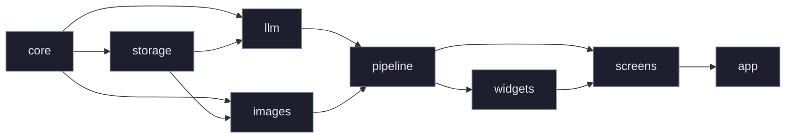

# Architecture Reference

Implementation details for contributors. High-level guidance lives in `CLAUDE.md`.

## Layered modules

Lower layers never import higher ones. `core` is a neutral bottom layer holding shared domain models (`Character`, `StoryBeat`, `StoryNode`, `Theme`, `Tone`, `NarrationStyle`, `ReaderLevel`, `TextProviderConfig`, `ImageProviderConfig`, etc.) so neither `storage` nor `llm` has to import the other. `app.py` is the only place that wires concrete providers/agents/pipelines into screens. `pipeline.py` sits between `llm + images` and `screens` — it coordinates the 3-stage beat flow and holds the `BeatAgentLike` / `IllustrationAgentLike` / `SummaryAgentLike` protocols that decouple the pipeline from specific pydantic-ai agent shapes.

## Web surface (optional API + frontend)

The TUI is the primary surface, but the package also ships an optional HTTP/WebSocket API (`src/storygen_api/`, installed via the `[api]` extra; console script `storygen-api`) and a Next.js 16 frontend (`web/`). The API is a **second composition root over the same lower layers** — it reuses `storage` / `llm` / `images` / `pipeline` wholesale and owns no game logic of its own. Run with `make api-dev` (FastAPI on `:8101`) and `make web-dev` (Next.js on `:8100`); the two servers are meant to run side-by-side on a developer's machine.

### Composition root

`storygen_api/deps.py::build_pipeline(save, config, *, callbacks)` mirrors `app.py`'s TUI wiring: it constructs a `BeatPipeline` and the routed/fallback image provider chain from the same `app_config` providers, then hands them to a `PipelineSessionManager` (`session.py`). The session manager keeps a per-`game_id` registry of `(save, pipeline)` pairs so a WebSocket reconnect or a follow-up REST request reuses the same pipeline rather than rebuilding it. Routers under `storygen_api/routers/` (games, wizard, images, characters, presets, tts, settings, ws) expose the full wizard + play loop over REST plus a `/api/ws/{game_id}` socket; `main.py` also mounts saved-game image directories at `/api/images` so the frontend can `` scene/portrait PNGs directly.

### Single-worker constraint (in-process state)

The server holds three module-level singletons that do **not** survive a second uvicorn worker: `PipelineSessionManager`'s pipeline registry, `WebSocketManager`'s per-game connection lists, and the TTS player. Scaling horizontally (gunicorn `-w N`, a platform that sets `WEB_CONCURRENCY`, or `uvicorn --workers N`) silently desyncs game state — a WS handshake landing on worker A drives a pipeline on worker B whose callbacks broadcast to a connection list that does not include the player. `main.py::lifespan` therefore calls `_enforce_single_worker()` at startup: if `WEB_CONCURRENCY > 1` the server raises `RuntimeError` and refuses to serve, and it logs a prominent warning otherwise (ARC-004). The Makefile's `api-prod` target pins `--workers 1`. Until those singletons move to a shared store (Redis / DB), this server is structurally single-process.

### WebSocket event contract

`ws.py::WebSocketManager.make_callbacks(game_id)` produces a `PipelineCallbacks` whose handlers broadcast the events the React frontend renders. The source of truth for the payload shapes is the TypeScript union `ServerEvent` in `web/src/lib/ws-types.ts`; the server mirrors it exactly and `tests/unit/test_api_ws.py` pins every payload against a pydantic mirror of the TS file (ARC-001). Events:

- `narration_delta` `{type, node_id, text}` — streaming narration chunk.
- `beat_committed` `{type, node_id, is_ending, choices[]}` — fired when the beat lands; `choices[]` must be non-empty so the player can pick the next step.
- `image_committed` `{type, node_id, image_path}` — scene illustration landed.
- `image_failed` `{type, node_id, error}` — scene illustration failed.
- `new_characters` `{type, characters[{id, name, backstory, personality, physical_description, portrait_path}]}` — full character cards (not just `{id, name}`).
- `error` `{type, code, message}` — note `message`, not `error`, matching `ServerError` in `ws-types.ts`.

`WebSocketManager._broadcast` snapshots the per-game connection list under an `asyncio.Lock` before iterating, so a concurrent `disconnect` (a peer dropping in another task) cannot mutate the list mid-iteration with `RuntimeError: list changed size during iteration` (ARC-009).

### WebSocket input validation

`routers/ws.py` authenticates the handshake before accepting (SEC-001; bearer token via `Sec-WebSocket-Protocol: bearer.<token>` for browsers or the `Authorization: Bearer` header for non-browser clients, fail-closed when `STORYGEN_API_TOKEN` is unset), checks the browser `Origin` against an allowlist (SEC-011), and caps inbound messages at 64 KiB. ARC-007 adds payload validation: an `advance` frame's `from_node_id` must exist in `save.nodes` and `choice_id` must be one of that node's `choices[].id`. Unknown ids are rejected with a `bad_request` error event before the pipeline is invoked — pre-ARC-007 they were passed straight through and either tripped the pipeline's internal `ValueError` after LLM/image work had started, or silently produced a bogus beat.

### Auth + SSRF defense

`storygen_api/security.py` gates every state-changing / cost-incurring REST route behind `verify_token`, which reads `STORYGEN_API_TOKEN` and fails closed (`503`) when the variable is unset, and uses `hmac.compare_digest` to avoid timing side channels. The same module enforces the SEC-002 SSRF defense: `validate_provider_base_url` rejects user-supplied `base_url` values that point at private / link-local / reserved IPs or hosts outside a small sanctioned-provider allowlist (OpenAI, OpenRouter, Z.AI, Gemini, ElevenLabs, Deepgram; loopback allowed only for Ollama). The WS handshake uses a parallel `ws_authorize` + `ws_check_origin` pair so the same guarantees apply to the socket surface.

### Server-side configuration sources

- Bind host: `storygen-api serve --host` (defaults to `127.0.0.1`, SEC-006). Pass `--host 0.0.0.0` **and** set `STORYGEN_API_TOKEN` for LAN exposure.
- CORS origins: `STORYGEN_API_ALLOWED_ORIGINS` (comma-separated; defaults to the dev frontend origins `http://{localhost,127.0.0.1}:8100`). `allow_methods`/`allow_headers` are pinned to the set the API actually uses (SEC-008).
- WS origin allowlist: `STORYGEN_WS_ALLOWED_ORIGINS` (defaults mirror CORS).
- Auth token: `STORYGEN_API_TOKEN` (required for any non-loopback deploy).

### Frontend data flow

`web/` is a thin client — it owns no game logic. Single source of truth for the backend base is `web/src/lib/config.ts` (ARC-016): it reads `NEXT_PUBLIC_API_BASE` (default `http://localhost:8101`) and exports both `API_BASE` and a derived `WS_BASE` (`http://` → `ws://`, `https://` → `wss://`). Every route, hook, and component imports from there — no port is hard-coded in more than one place. `web/src/lib/api.ts` is the typed fetch wrapper (`apiGet` / `apiPost` / `apiPut` / `apiPostForm` / `apiDelete` + domain interfaces mirroring the Pydantic models); `web/src/hooks/useWebSocket.ts` dispatches the events above into a Zustand `game-store` that components re-render off. See `web/README.md` and `web/AGENTS.md` for the route map, the per-feature data flow, and the Next.js 16 conventions the frontend follows.

## The 3-stage beat pipeline (`src/storygen/pipeline.py`)

`BeatPipeline.advance(save, from_node_id, choice_id)` is the heart of gameplay:

1. **Cache hit short-circuit** — if `parent.choice.child_node_id` already points at a node, return it; no LLM/image calls. Defensive `.get()` because legacy saves may carry bogus links (see "Choice schema split" below).
2. **Stage 1 — beat generation** — `beat_agent.run_stream(...)` resolves a `StoryBeat`. (Despite the protocol name, the adapter now uses `agent.run()` underneath — see "LLM call adapters" — so it's a single round-trip, not character-by-character streaming. The narration arrives as one `on_narration_delta` call once the beat resolves.) The new node is committed and persisted before stage 2 begins. `on_beat_committed` fires here. If `beat.new_characters` is non-empty, `on_new_characters` fires next so the UI can toast the introduction.
3. **Stage 2 + 3 (concurrent)** — `_run_stage_2_and_3` runs the illustration agent and any new-character portrait generation in parallel; if `should_illustrate`, scene rendering is launched as a fire-and-forget `asyncio.create_task`. `on_image_committed` / `on_image_failed` fire when the background scene task finishes.

The optional summary agent runs after `is_major` beats and writes `node.summary_to_here`. The summary is built incrementally: the agent receives the previous major beat's `summary_to_here` plus the full narration of all beats between that anchor and the current one (via `segment_since_last_summary` in `tree.py`), then produces a cumulative "story so far" paragraph. Non-major beats never store a summary — they read the nearest ancestor's via `segment_since_last_summary`.

## Mid-story character introductions

When a beat returns `new_characters: list[Character]`, those characters are appended to `save.characters` (so the CAST roster includes them in every subsequent `_build_beat_prompt`). `_portraits` then generates a reference portrait for each new character — wrapped in per-character try/except so one provider failure doesn't kill the rest, and saving both `portrait_path` AND `portrait_prompt` (the original `physical_description`) so PortraitsScreen can later regenerate them with the same prompt the wizard would have used. The portrait is written as `<char_id>-v1.png`. Once on disk, downstream `_stage_3_scene` calls automatically pick the new character's portrait up via `featured_character_ids` lookup, keeping them visually consistent across scenes.

## Per-beat prompt contents

`_build_beat_prompt` (in `pipeline.py`) assembles each beat's user-side prompt from:

- **CAST** — every `save.characters` entry condensed to one line (personality + physical description), so the LLM doesn't drift on character traits.
- **STORY-SO-FAR SUMMARY** — the `summary_to_here` from the nearest ancestor major beat (via `segment_since_last_summary`), or omitted if none exists yet.
- **BEATS SINCE LAST SUMMARY** — full narration of every node between the summary anchor and the current position (chronological order), each tagged with the choice the player picked to reach it. When no summary anchor exists (early game), all beats from the root are included.
- **PLAYER JUST CHOSE** — choice text.
- A dynamic pacing hint (if non-empty) based on major-beat depth vs `target_major_beats` (silent ≤30%, "tension rising" ≤60%, "tighten toward climax" ≤90%, "resolve now" >90%).

The system prompt (`prompts.beat_system_prompt`) layers theme, tone (with custom-descriptor support), narration-style guidance, **reader level** vocabulary/complexity rules, `target_major_beats` pacing targets, continuation rules, and per-playthrough style reminders (for `first_person` and `fourth_wall`) — all static content that never changes mid-playthrough is in the system prompt for optimal API prompt-cache hit rates.

## `is_major` semantics

The LLM sets `StoryBeat.is_major: bool` per beat. Two consumers:

1. **Summary trigger** — `BeatPipeline.advance` only runs the summary agent when `is_major and self._summary is not None`. Non-major beats produce no `summary_to_here`, so `latest_summary()` walks back further to find one.
2. **Pacing target** — `save.target_major_beats` (set in the wizard, default 5, clamped 2-30) is the resolution budget. `_build_beat_prompt` counts `sum(1 for n in chain if n.is_major)` from the ancestor chain, **not** total beat count, when generating the pacing hint.

The system prompt and per-beat directive both push the LLM toward ~1 major per 2-3 total beats. Without that nudge LLMs default to marking nearly every beat major.

## Pipeline callbacks

`PipelineCallbacks` (default no-ops everywhere) is how the pipeline reports progress to a UI screen. Five callback slots:
- `on_narration_delta(delta: str)` — fired once after the beat resolves with the full narration (despite the streaming-era name).
- `on_beat_committed(node: StoryNode)` — beat persisted to disk; safe to re-render the play screen.
- `on_image_committed(node: StoryNode)` / `on_image_failed(node: StoryNode)` — background scene task lands.
- `on_new_characters(characters: list[Character])` — fires after a beat that introduces new characters; PlayScreen wires it to a "X joined" toast.

PlayScreen passes an explicit `PipelineCallbacks` instance to `advance()` on every `_pick` so the wiring stays scoped to one call rather than mutating shared pipeline state.

## Choice schema split (important)

`src/storygen/core/models.py` deliberately separates LLM-facing and storage shapes (`src/storygen/llm/models.py` is a backward-compat re-export shim):

- `Choice` — `id` + `text` only. Used in `StoryBeat.choices`. The pydantic-ai schema sent to the LLM contains only these fields, so the model literally cannot invent a `child_node_id`.
- `StoredChoice(Choice)` — adds `child_node_id: NodeId | None`. Used in `StoryNode.choices`. Only the pipeline ever writes that field (when wiring a real child node).

Conversion happens at the pipeline boundary: `[StoredChoice(id=c.id, text=c.text) for c in beat.choices]` lifts each LLM Choice when persisting. The reverse direction (rebuilding a `StoryBeat` from a stored node for the illustration agent) does the inverse `Choice(...)` cast.

## Graph semantics

- Tree, not DAG. Every non-root node has exactly one parent. Branches never re-join.
- Once a node is generated, its narration / choices / image are frozen. Revisiting a `(parent_id, choice_id)` pair replays the cached subtree.
- Endings are terminal nodes (`is_ending=True`). Each reached ending is appended to `save.endings_reached` and persists forever.
- Regenerate (`r` on PlayScreen, `check_action` gated to non-root leaf nodes) clears the parent's `child_node_id` link, deletes the current node, and re-invokes `_pick` — this would orphan descendants, hence the leaf gate.

## Provider factories

Both LLM and image providers go through factories so v1.1 can flip a config switch:

- `llm/provider_factory.py` — `build_text_model(TextProviderConfig)` returns an `OpenAIChatModel` configured for OpenAI / OpenRouter / Ollama (all OpenAI-compatible — same client, different `base_url`).
- `images/provider_factory.py` — `build_image_provider(ImageProviderConfig)` dispatches to one of four providers (OpenAI, Gemini, Z.AI, Ollama) based on `config.provider`. `build_routed_image_provider` wraps the primary in a `RoutedImageProvider` with an optional fallback; when the primary raises, the router transparently retries against the fallback and chains the original exception as `__cause__`.
- `images/split_provider.py` — `SplitImageProvider` keeps the public `ImageProvider` protocol but routes `generate_portrait()` to the character portrait provider and `generate_scene()` to the scene/cover art provider.

## LLM call adapters (`src/storygen/app.py`)

The pipeline's `BeatAgentLike` / `IllustrationAgentLike` / `SummaryAgentLike` Protocols are deliberately thin. Three adapter classes in `app.py` bridge them to pydantic-ai's `Agent`:

- `_BeatAgentAdapter` — implements `BeatAgentLike.run()`. pydantic-ai's `run_stream()` doesn't retry on output-validation failure (the `StoryBeat._ending_has_no_choices` validator was tripping `UnexpectedModelBehavior` mid-stream); `run()` retries up to the agent's normal budget. Beat generation is fast enough that the player doesn't actually need character-by-character streaming — the full narration is delivered as one `on_narration_delta(narration)` call after `run()` resolves, replacing the "Generating next beat…" placeholder atomically.
- `_IllustrationAdapter`, `_SummaryAdapter` — wrap `agent.run()`.

All three accept an optional `on_usage: Callable[[object], None]` callback. `_start_game` wires this to `record_usage_on_save(...)` (in `llm/usage.py`) so token totals accumulate on the save and the play-screen header refreshes after every call.

## Image provider architecture

Four providers sit behind a shared `ImageProvider` protocol: **OpenAI** `gpt-image-2` (default for scene/cover art; uses `images.edit` for reference-portrait calls — the older `gpt-image-1` / `gpt-image-1.5` models also pass `input_fidelity="high"`, but `gpt-image-2` omits that param since the API does not accept it), **Gemini** Nano Banana 2 / Pro (scene refs only — per-character `reference_image_path` is ignored by `GeminiImageProvider.generate_portrait`), **Z.AI** GLM-image (no refs — generation only), and **Ollama** local inference (no refs). Character portraits also default to OpenAI `gpt-image-2`; `gpt-image-2` does not accept the transparent-background flag, so portrait calls fall back to `background="opaque"` (solid neutral) and rely on prompt text alone — choose `gpt-image-1` / `gpt-image-1.5` for true transparent PNG portraits. Ref-support status matters because `_stage_3_scene` passes `featured_character_ids`' portrait bytes as `reference_portraits=`; non-ref providers silently drop them.

Image config is split by purpose. `ImageProviderPrefs` (in `storage/app_state.py`) persists scene/cover art settings from the "Image provider" Settings block; environment overrides use `STORYGEN_IMAGE_PROVIDER`, `STORYGEN_IMAGE_MODEL`, `STORYGEN_IMAGE_BASE_URL`, and `STORYGEN_IMAGE_API_KEY`. `CharacterImageProviderPrefs` persists portrait settings from the "Character portrait provider" Settings block; environment overrides use `STORYGEN_CHARACTER_IMAGE_PROVIDER`, `STORYGEN_CHARACTER_IMAGE_MODEL`, `STORYGEN_CHARACTER_IMAGE_BASE_URL`, and `STORYGEN_CHARACTER_IMAGE_API_KEY`. Each new `GameSave` pins both `save.image_config: ImageProviderConfig` (scene/cover art) and `save.character_image_config: ImageProviderConfig` (portraits), so switching providers mid-run doesn't rewrite history.

`app.py` builds a `SplitImageProvider` for new and loaded saves. The scene/cover half is built from `save.image_config`; the portrait half is built from `save.character_image_config`. Each half is first wrapped by `build_routed_image_provider` (in `images/provider_factory.py`), so the configured fallback can recover either scene or portrait calls. (`build_image_provider` constructs a single concrete provider and is used internally by the routed builder.) Two optional callbacks thread up to `app.py` for UX: `on_ref_loss` (toasts when a ref-aware save was switched to a non-ref provider) and `on_fallback` (toasts when the primary failed and fallback succeeded).

**Cost tracking** goes through `images.pricing.image_cost(provider, *, model, size, quality, num_input_refs, partial_images)` — a single dispatcher that picks the right table per provider (OpenAI's size×quality matrix, Gemini's resolution tiers, Z.AI's flat rate, Ollama's $0). Pipeline, wizard, and portraits screen call this dispatcher with `save.character_image_config.provider` / `.model` for portrait and outfit work, and with `save.image_config.provider` / `.model` for scene/cover art, so per-save costs reflect the provider that actually generated each image type.

## Cross-game character library

The character library UI is implemented in `CharacterCatalogScreen` (`screens/library_browser.py`).

Characters can be exported from a finished story's PortraitsScreen (Export button) and re-imported into the wizard of a new story. The library lives at `$XDG_DATA_HOME/storygen/library/<library-id>/` — one subdirectory per exported character holding `character.json` (a `LibraryCharacter` model) and `portrait.png`. `LibrarySource` (`save_id` + `save_title`) tags each entry with its originating save so humans can still identify a character after the source game is gone. `storage/library.py` owns atomic CRUD (`save_library_character` writes portrait first, then JSON — the JSON is the "committed" marker so readers never see a dangling portrait-less entry; `_validate_library_id` rejects anything that isn't a uuid4 hex to block path traversal). Library-id is independent from the save-local `Character.id` so re-exporting the same character creates a distinct library entry (no dedup — CharacterCatalogScreen's Delete button is the cleanup UX; `s` toggles the ephemeral newest↔name sort). The browser is reachable from WizardScreen's CHARACTERS step via the `l` binding and dismisses with `LibraryPick(character, mode=Literal["keep","adapt"])`; `keep` commits immediately, `adapt` fires `WizardFlow.adapt_library_character` (which rewrites **only** `backstory` via the adapt agent and preserves name/personality/physical_description/portrait_prompt so the existing portrait stays visually valid — this is the load-bearing invariant the adapt agent's prompt enforces, and the method rejects empty-string outputs with `ValueError` so a broken agent response doesn't silently wipe the backstory). Imported characters are threaded through `WizardFlow.build_initial_save` via `library_import_ids: dict[character_id, library_id]`, which causes per-character portrait copy (`shutil.copy`) instead of a fresh `generate_portrait` call — the image provider is never invoked for imported cast, saving both token cost and latency.

## Wizard usage tracking

`WizardFlow` runs LLM calls (theme, characters, blurb) **before the GameSave exists**, so it accumulates usage in a private `UsageTotals` instance. At the end of `build_initial_save`, `self._usage_totals.apply_to_save(save)` merges the totals into the freshly-built save. Wizard tests construct `WizardFlow` with `text_config=` so the model name is recorded correctly.

The `blurb_agent_factory` signature is `Callable[[Theme, list[Character], NarrationStyle], _AgentLike]` — the narration style threads all the way to `blurb_system_prompt` so the back-cover blurb voice matches the chosen narration style (first-person/protagonist-POV, third-person, or fourth-wall-with-asides; the third option suppresses the default second-person "you" marketing voice that would otherwise leak into every subsequent beat as prior context). `app._backfill_blurb_if_missing` (which runs once on legacy saves with empty root narration) does the same threading via `save.narration_style`.

## Persistence

- `storage/save.py` — `GameSave` Pydantic model + `save_game()` (atomic via `.json.tmp` + `os.replace`) + `load_game()` + `prune_subtree()` (removes a node and all descendants, clears the parent's `child_node_id` link, relocates `current_node_id` if inside the pruned subtree, removes pruned nodes from `endings_reached`, deletes associated image and audio files, and persists). Add new fields **with defaults** so legacy saves keep loading. Per-save fields beyond the obvious: `art_style` (string passed to image-gen prompts), `pacing` (`Pacing` Literal — `slow`/`moderate`/`fast`; default `moderate`), `reader_level` (`ReaderLevel` Literal — `ages_0_5`, `ages_6_10`, `ages_11_15`, `ages_15_plus`; default `ages_11_15`; steers vocabulary/complexity in the beat system prompt), `target_major_beats` (resolution budget), `image_config` (scene/cover art; defaults to OpenAI `gpt-image-2`), `character_image_config` (portraits; defaults to OpenAI `gpt-image-2`), `total_image_cost_usd`, `text_total_input_tokens` / `text_total_output_tokens` / `text_total_requests`, `text_calls_by_model: dict[str, int]`.
- `storage/paths.py` — XDG-compliant. Saves live at `$XDG_DATA_HOME/storygen/games/<uuid>/`. Portraits use versioned filenames `<char_id>-v<N>.png`; new versions never overwrite old ones. `next_portrait_version()` returns `max(N) + 1`.
- `storage/app_state.py` — small JSON at `$XDG_CONFIG_HOME/storygen/state.json` keyed by:
  - `last_story_id` — `app_state.remember_last_story()` is called from `_start_game`; `last_story_id()` powers `--resume` / `make resume`.
  - `provider_prefs` — text LLM provider preferences (`ProviderPrefs` dataclass: provider/model/base_url). Defaults: `openai` / `gpt-4o-mini` / empty base URL.
  - `prefetch_enabled` / `prefetch_images` — branch prefetch master switch and images-within-prefetch switch (both default OFF, opt-in). Read **live** at decision points so Settings toggles take effect on the next beat.
  - `wizard_defaults` — a `WizardDefaults` dataclass (theme/tone_preset/tone_descriptor/narration_style/art_style/reader_level/pacing/characters/target_major_beats/save_to_catalog). The Settings screen edits these; the wizard reads them at launch and pre-fills every widget. Constants: `DEFAULT_ART_STYLE = "children's story book"`, `DEFAULT_TARGET_MAJOR_BEATS = 5`, `MIN/MAX_TARGET_MAJOR_BEATS = 2/30`, `DEFAULT_TONE_PRESET = "serious"`, `DEFAULT_NARRATION_STYLE = "third_person"`, `DEFAULT_READER_LEVEL = "ages_11_15"`, `DEFAULT_PACING = "moderate"`.
  - `art_enabled` — global on/off for image generation. Read **live** at decision points (`art_enabled()`) so toggling Settings takes effect on the next pipeline action without restart. Pipeline's `_run_stage_2_and_3` and `_portraits` skip image work when off; PortraitsScreen disables Regenerate buttons; wizard's `build_initial_save` skips portrait generation; `retry_scene` no-ops.
  - `image_provider_prefs` — scene/cover art provider prefs (`STORYGEN_IMAGE_*` when overridden by env). Defaults: `openai` / `gpt-image-2`.
  - `character_image_provider_prefs` — character portrait provider prefs (`STORYGEN_CHARACTER_IMAGE_*` when overridden by env). Defaults: `openai` / `gpt-image-2`.
  - `image_streaming` — opt-in toggle (default OFF) for OpenAI streaming partial-image previews during scene generation. When enabled AND `save.image_config.provider == "openai"`, `_stage_3_scene` and `retry_scene` request `partial_images=OPENAI_PARTIAL_IMAGES` (= 2) so the image panel shows low→high resolution previews as they arrive. Adds ~5% to OpenAI image cost. A no-op for non-OpenAI providers and intentionally scene-only. Read **live** at decision points. Exposed as "Stream partial scene previews" in Settings.
  - `llm_cache` — dev/debug toggle (default OFF) for raw LLM exchange dumping. When on, `BeatPipeline._maybe_build_raw_sink(save_id, node_id, agent_name)` returns a closure that the adapters in `app.py` invoke with `result.all_messages_json()`; the bytes are written to `<save-dir>/llm/<node-id>-<agent>.json` (agents: `beat`, `illustration`, `summary`, `blurb`) via `storage/llm_cache.py`'s atomic `.tmp + os.replace` writer. Per-call closure → safe under prefetch concurrency. Read **live** so the Settings toggle is immediate. Wizard-stage agents (theme/characters/adapt-backstory) pre-date the save dir and are intentionally **not** cached — only the blurb backfill (keyed to `save.root_node_id`) and beat-loop agents are. All sink invocations are wrapped in `contextlib.suppress(Exception)` because the cache is debug-only and must never crash gameplay.
  - `tts_prefs` — persisted TTS provider preferences (`TTSPrefs` dataclass: provider/api_key/voice/auto_read). Defaults: `openai` provider, empty api key (falls back to env var), empty voice (provider default), auto_read OFF.
  - `auto_select` — persisted default for the auto-select story-play mode (default OFF). The `a` hotkey toggles it live regardless of the persisted value.
  - `auto_open_art` — persisted toggle (default OFF) for auto-opening full-res images in the system viewer when generated. Applies to scene illustrations, portrait regenerations, reference-image sets, outfit creation, and library portrait generation. Read **live** so Settings toggles take effect immediately. Gated by `art_enabled` in the Settings UI.
- `storage/tree.py` — pure helpers (`path_from_root`, `ancestors`, `children`, `children_index`, `descendants`, `latest_summary`, `segment_since_last_summary`). `children_index` pre-builds a parent-to-children map for O(n) full-tree walks (used by the graph renderer and `descendants`). `descendants` returns a node and all its descendants in BFS order (used by `prune_subtree`). The last summary helper walks ancestors to find the nearest node with `summary_to_here` and returns `(prev_summary, segment_beats)` — used by both `_build_beat_prompt` (beat context) and the summary agent (incremental major-beat summaries).

## Cost + token tracking

- Image cost: `images/pricing.image_cost(provider, *, model, size, quality, num_input_refs, partial_images)` — provider-dispatching lookup table. `PORTRAIT_SIZE / PORTRAIT_QUALITY / SCENE_SIZE / SCENE_QUALITY / OPENAI_PARTIAL_IMAGES` live in `images/constants.py` and are imported by the wizard, portraits screen, and pipeline so all three compute cost consistently with what the provider actually requested. (`images/openai_provider.image_cost` is kept as a thin shim for legacy call sites that import from the provider module directly.) Portraits/outfits are charged against `save.character_image_config`; scenes/covers are charged against `save.image_config`. The portrait prompt also threads `art_style` (from `save.art_style`) into the user-facing image prompt, and includes a hardcoded "no props/empty hands" directive so portraits work as neutral reference anchors for `images.edit` calls on scene generation.
- Token usage: `llm/usage.record_usage_on_save(save, model=..., usage=...)` reads `input_tokens / output_tokens / requests` off pydantic-ai's `RunUsage` via `getattr` (tolerates version drift). Surfaced in the PlayScreen header sub-title alongside the cumulative cost.

## Screens overview

`intro` (figlet splash, auto-dismisses after 2.5s or on keypress; skipped with `--resume`) → `menu` (centered buttons, keyboard shortcuts) → `wizard` (8 steps: THEME → TONE → STYLE → ART_STYLE → LENGTH → READER_LEVEL → CHARACTERS → CONFIRM, all pre-filled from `WizardDefaults`) → `play` (the main loop). `load` lists existing saves (one row per save with cover-art thumbnail, title, metadata, and explicit Load/Delete buttons; Delete requires confirmation via `ConfirmModal`). `settings` is a multi-section form covering text provider, scene/cover art provider (with optional fallback), character portrait provider, wizard defaults, image generation toggles (`art_enabled`, `image_streaming`, `auto_open_art`), branch prefetch toggles, developer toggles (`llm_cache`, `auto_select`), and TTS settings (provider/api key/voice/auto-read); Save persists everything atomically via `write_all_settings`, Reset clears widgets without persisting. `play` opens modal `portraits` (per-character Regenerate buttons; disabled when `art_enabled=False`) or `graph` (Tree view of the full save tree with marker legend, current-node arrow, unexplored-choice leaves, and `p` prune action; press `g` from play). PlayScreen's `x` binding triggers `export_book` (in `export/book.py`), which renders the current path as a standalone HTML file with 3D page-turn effects. `ArtEditModal` (`screens/_art_edit_modal.py`) provides prompt editing and optional current-image-as-reference for scene regeneration via `pipeline.edit_scene`. All screens reachable from `play` re-render on `on_screen_resume` so mutations made in modals (new portraits, jumped node) reflect immediately. `LibraryEditModal` (in `screens/_library_edit_modal.py`) provides in-place editing of a character's fields in the Character Catalog (`CharacterCatalogScreen`); it validates required fields before saving and warns when a physical-description change will invalidate existing portraits. `StoryImportModal` (in `screens/_story_import_modal.py`) scans all existing saves and lists their character rosters with per-save sections, each containing a Select All checkbox and per-character checkboxes; the user picks which characters to import into the character catalog.

Ending beats display a pyfiglet "The End" banner (font "big", bold) above the final narration in the story panel. The intro screen uses the "blocky" font with a per-line Rich color gradient (pink-purple → purple → blue-violet → blue → teal → teal) so the `█` blocks render with full color fill.

`PlayScreen.ImagePanel` is sized to the known half-block render dimensions of a scene image (50×26 cells = 48×24 image cells + 1-cell rounded border each side). Don't override `padding` on the panel — it eats into the image. `ImagePanel` and every portrait/library thumbnail (built via `render_image_thumbnail` in `widgets/_image_util.py`) gain an accent-colored hover border as the click affordance; `on_click` opens the image file via `util.open_in_system_viewer()` (delegates to `open` / `xdg-open` / `os.startfile`).

## Endings + replay screens

Two read-only review screens layer on top of `play` once the save has explored content. **`EndingsScreen`** (`screens/endings.py`) is a modal pushed from PlayScreen via the `e` binding (gated in `check_action` on non-empty `save.endings_reached`); it renders one card per reached ending with the scene image, a narration excerpt, and a breadcrumb of the choices that led there. Each card's **Jump** button invokes a `on_jump_to_node` callback that PlayScreen wires to its standard "set `current_node_id` and re-render" path so the user lands on that ending node. **`ReplayScreen`** (`screens/replay.py`) is a modal pushed from GraphScreen via the `r` binding; it walks `path_from_root(save, target_node_id)` step-by-step as a press-to-advance read-only slideshow (`space/right/n` advance, `left/p` back, `j` jumps to live play at the **current cursor node** — not the original target — so the player can stop midway and resume from there, `escape` exits). Replay dismisses itself before invoking the jump callback so the screen-stack pop chain (replay → graph → play) lands the user back on PlayScreen at the chosen node. GraphScreen's **`_jump_to(node_id)`** helper is the shared wiring point for both direct tree-node selection and replay-jump, keeping the "select-and-pop" semantics identical regardless of how the node was chosen.

## Branch prefetch (v2)

Background-generates the next beat for each pending choice while the player reads the current one, so picking a prefetched choice short-circuits straight to a cache hit. Two persisted flags in `storage/app_state.py` gate it: `prefetch_enabled()` (master switch) and `prefetch_images_enabled()` (whether prefetch should also run stage-3 scene generation; UI-disabled unless both prefetch and `art_enabled()` are on). Both are read **live** at decision points so Settings toggles take effect on the next beat without restart. `BeatPipeline` owns a `_prefetch_tasks: dict[tuple[NodeId, ChoiceId], asyncio.Task]` keyed by `(parent_id, choice_id)` — `start_prefetch` is idempotent (re-firing for an in-flight key is a no-op) and `cancel_all_prefetches` cleans up on screen unmount. A per-pipeline `asyncio.Semaphore(_PREFETCH_CONCURRENCY=3)` caps concurrent LLM calls so wide branching doesn't stack tasks faster than they complete. `advance` gains two kwargs: `skip_image: bool = False` (records the illustration plan but skips fire-and-forget scene generation — used when prefetch_images is off) and `suppress_side_effects: bool = False` (no `current_node_id` mutation, no `endings_reached` append, no `on_narration_delta` callback, no `_callbacks.*` fires — prefetch always passes this). The narration delta guard is critical: without it, the prefetched beat's text would stream into the currently-displayed story panel. At the top of `advance` (gated by `not suppress_side_effects` so the recursive prefetch path doesn't re-await itself), `await_prefetched((parent_id, choice_id))` pops the task, awaits it, and returns `None` on failure or missing key — falling through to the normal generation path. PlayScreen's `_maybe_start_prefetch` hook fires from `_render_current` whenever `_loading=False` and the current node has unexplored choices; `on_unmount` calls `cancel_all_prefetches`. Failure dedupe lives in `_prefetch_failure_logged: set[tuple[NodeId, ChoiceId]]` — a per-key one-shot at INFO level so a down provider doesn't flood the log; cleared on the next successful prefetch for that key.

## Reference images for characters

Characters accept an optional `reference_image_path: str | None` (relative to the save dir). The wizard's CHARACTERS step offers a per-character "Reference image" button (via `_ref_image_modals.ReferenceImageModal`) that lets the user pick a local PNG/JPG/WebP file and choose between "use as-is" or "style-transfer" mode. In "use as is" mode, the selected image bytes are passed directly as the `reference_image` kwarg to `ImageProvider.generate_portrait`; in "style-transfer" mode, the image is used as an `images.edit` input and regenerated in the save's `art_style`. The path is persisted on `Character.reference_image_path` so the portrait can be regenerated later. Only `OpenAIImageProvider.generate_portrait` honors the `reference_image` kwarg today; `GeminiImageProvider`, `ZaiImageProvider`, and `OllamaImageProvider` drop it (Gemini still uses multi-portrait `reference_portraits` for scene generation, just not the single-ref portrait path).

## Character outfits (v2.2)

`CharacterOutfit(id, name, description, portrait_path, portrait_prompt, created_at)` lives on `Character.outfits`; `Character.current_outfit_id` marks the active one. PortraitsScreen's outfits sub-row renders mini half-block thumbnails via `rich_pixels`; `OutfitCreateModal` (`screens/_outfit_modals.py`) drives name+description → background `generate_portrait` worker (art style from save, prompt is `physical_description + ". Outfit: " + outfit_description`). PNG is atomic-written to `paths.character_outfit_path(save_id, char_id, outfit_id)`. `OutfitActionModal` yields `"set" | "delete" | None`. **Setting** copies the outfit's `portrait_path` + `portrait_prompt` into `Character.portrait_path` + `Character.portrait_prompt` so the existing scene-gen path (which reads `Character.portrait_path`) picks it up without code change. **Deleting** the active outfit auto-reverts to base v1 first so there's no window with a dangling active reference. **Revert-to-base** restores `portrait_path = relative_character_portrait_path(char_id, 1)` and `portrait_prompt = physical_description`. Outfit gen reuses the existing portrait cost accounting (no new surcharge paths); streaming is intentionally skipped because portraits are too fast to benefit. Library export captures only the currently-active outfit; imported characters start with an empty `outfits` list.

## Text-to-speech (`src/storygen/tts/player.py`)

`TTSPlayer` wraps the `par_tts` library for async use inside Textual's event loop. A four-state machine (`IDLE → GENERATING → PLAYING → PAUSED → PLAYING → IDLE`) drives all controls:

- **`speak(text, *, cache_path=None)`** — uses the configured `par_tts` provider's async generation API when available (with a sync fallback), then plays the completed file through `asyncio.create_subprocess_exec` (`afplay` on macOS). If `cache_path` is given and the file exists, skips generation and plays the cached file directly. If the file doesn't exist, writes generated audio to a temporary sibling file and atomically replaces `cache_path` only after the full byte stream is written. Returns `bool` indicating success.
- **`pause()` / `resume()`** — sends `SIGSTOP` / `SIGCONT` to the `afplay` subprocess.
- **`stop()`** — cancels in-flight generation/write work, sends `SIGTERM` to active playback, and removes partial temporary output without deleting valid persistent cache paths.
- **`restart()`** — convenience: `stop()` then re-speak.

`PlayScreen` integrates TTS at two levels:

1. **Auto-read** (`app_state.tts_prefs.auto_read`, togglable in Settings) — after every beat commit, `_maybe_auto_read()` launches `_speak_current_node()` as a named worker. Audio files are cached per node, provider, and voice in the save's `audio/` directory. The cache file extension follows the active TTS provider's preferred output format, so changing provider or voice generates a separate cache entry instead of replaying stale narration.
2. **Manual controls** — `t` (pause/resume), `T` (restart), `s` (stop). Action handlers are kept synchronous (pause/resume/stop are fast calls; speak uses `run_worker`) so Textual's message pump never blocks and all key bindings stay responsive during generation.

Settings stores `tts_provider`, `tts_api_key`, `tts_voice`, and `auto_read` via `TTSPrefs` in `app_state`. Supported providers: OpenAI, ElevenLabs, Deepgram, Google Gemini, and Kokoro (local). API keys fall back to per-provider env vars (`OPENAI_API_KEY`, `ELEVENLABS_API_KEY`, `DEEPGRAM_API_KEY`, `GEMINI_API_KEY`; Kokoro needs no key). The `t` binding label toggles between "Pause speech" / "Resume speech" based on `player.state`.

## Auto-select

Pressing `a` on `PlayScreen` toggles an automatic story-play mode that picks random choices and advances until an ending is reached. The implementation is a chain of exclusive workers rather than a continuous loop:

1. **`action_auto_select()`** — toggles `_auto_selecting` and kicks off `_auto_select_next()` as an `exclusive=True` worker named `"auto-select-next"`.
2. **`_auto_select_next()`** — one cycle: waits for the current node's scene image to reach a terminal state (`done`, `failed`, or no image planned), applies the image viewing delay (5 seconds after `_image_displayed_at` when art is enabled and an image displayed), waits for TTS completion (polls `_tts_player.state` until `IDLE`, including `PAUSED` so paused speech must finish before advancing), picks a random `n` in `[1, len(choices)]`, calls `await self._pick(n, auto_read_inline=True)`, then schedules the next cycle via another `run_worker(..., exclusive=True, name="auto-select-next")`. The inline auto-read flag makes the pick await the new beat's narration playback before the following auto-select cycle can continue.
3. **Termination** — the cycle stops when `_auto_selecting` is `False`, the current node `is_ending`, or there are no choices. `on_unmount` sets `_auto_selecting = False` to clean up.

**Action gating** during auto-select (`check_action`): only `menu`, `auto_select`, `tts_toggle`, `tts_stop`, and `tts_restart` are allowed. This lets the user pause/restart speech or stop auto-play at any point without accidental navigation. The `_loading` guard also permits `auto_select` so the user can toggle it off mid-pipeline.

The `auto_select_enabled` setting in `app_state` (persisted as `state["auto_select"]`, exposed as a Switch in the Settings "Developer" section) is a default only — the hotkey toggles it live regardless of the persisted value.

## Deferred illustration fix

`BeatPipeline._maybe_deferred_illustration(save, node, callbacks)` retroactively triggers scene generation for nodes that have an illustration plan but no image. This handles the case where branch prefetch generates a node with `skip_image=True` (or `prefetch_images_enabled` is off), leaving `image_status="not_planned"` even though the beat's illustration plan requested an image.

Called at both the prefetch fast-path return and the cache-hit return in `advance()`, it reconstructs an `IllustrationPlan` from the node's stored `image_prompt`, `image_reasoning`, and `featured_character_ids`, sets `image_status="generating"`, and spawns `_stage_3_scene` as a background task. The `i` (retry image) key on PlayScreen is also enabled for `not_planned` nodes with an existing prompt, giving manual recovery if the deferred attempt failed.

## Scene edit + retry

`BeatPipeline.retry_scene(save, *, node_id, callbacks)` regenerates a scene image using the node's stored `image_prompt`. `edit_scene(save, *, node_id, new_prompt, current_image_as_ref, callbacks)` replaces the stored prompt before regenerating and optionally uses the current scene image as an additional reference. Both delegate to the shared `_render_scene` helper, which handles the full write-status-callback cycle. `retry_scene` is wired to PlayScreen's `i` binding; `edit_scene` is wired through `ArtEditModal` (`screens/_art_edit_modal.py`) which provides prompt editing and a current-image-as-reference toggle.

## Subtree pruning

`prune_subtree(save, *, node_id)` (in `storage/save.py`) removes a node and all its descendants using `tree.descendants()` for BFS traversal. It clears the parent's `child_node_id` link (reverting the choice to "unexplored"), relocates `current_node_id` to the parent if it was inside the pruned subtree, removes pruned nodes from `endings_reached`, deletes associated image and audio files from disk, and persists the mutated save. GraphScreen's `p` binding triggers this via a `ConfirmModal` dialog.

## Textual quirk: Header startup race

`src/storygen/_textual_patches.py` monkey-patches `textual.widgets.Header._on_mount` to also catch `NoMatches`. Textual's `set_title` watcher fires synchronously on registration to seed the title, but at that point Header's `HeaderTitle` child hasn't mounted yet — upstream catches `NoScreen` but not `NoMatches`, so the exception leaks as a "coroutine never awaited" traceback at startup. The patch is imported for side effects from `app.py` and **must be applied before any Header is constructed**.

## Design docs archive

Two historical archives under `docs/` capture the design rationale for shipped features. They are reference material, not current specs — the code is the source of truth — but they are the right starting point when revisiting a feature's tradeoffs.

- **`docs/subagents/`** — long-form architecture summaries written by sub-agents during the original work. `docs/subagents/summary_cff1cda7.md` is the only web-architecture write-up: it recommends the FastAPI + Next.js split and walks through reusing the `core`/`storage`/`llm`/`images`/`pipeline` layers as a second composition root (exactly what shipped). `docs/subagents/summary_41a3b928.md` is a v0.5.0 codebase-wide architecture summary.
- **`docs/superpowers/specs/`** — one design spec per major feature, dated (`YYYY-MM-DD-<feature>-design.md`). Examples: `2026-04-18-storygen-design.md` (the original v1.0 spec), `2026-05-03-relationship-tracking-design.md`, `2026-05-03-graph-prune-design.md`, `2026-05-03-templates-recap-gallery-design.md`. Adjacent `docs/superpowers/plans/` holds the matching implementation plans.

When you change a feature materially, cite the relevant spec from this archive in your PR description and note where the implementation has diverged from the original design.
