# New Story Wizard

The new story wizard is a multi-step flow that configures your story before it begins. Each step has a hint at the top and a **Next** button at the bottom. Press **Escape** at any time to return to the main menu.

## Table of Contents

- [Step 1: Theme](#step-1-theme)
- [Step 2: Tone](#step-2-tone)
- [Step 3: Narration Style](#step-3-narration-style)
- [Step 4: Art Style](#step-4-art-style)
- [Step 5: Story Length](#step-5-story-length)
- [Step 6: Reader Level](#step-6-reader-level)
- [Step 7: Characters](#step-7-characters)
- [Step 8: Confirm](#step-8-confirm)
- [Starting the Story](#starting-the-story)

## Step 1: Theme

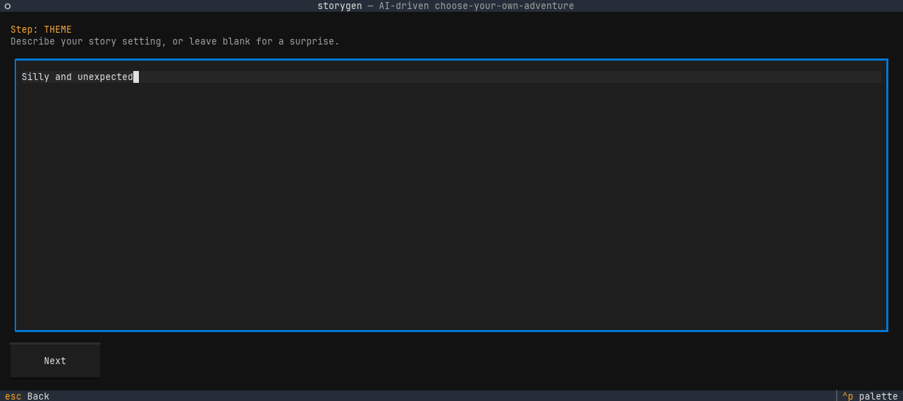

Describe the setting and premise for your story, or leave it blank and the LLM will invent one. The text area becomes read-only once you press **Next** to prevent accidental edits while the theme is being generated.

## Step 2: Tone

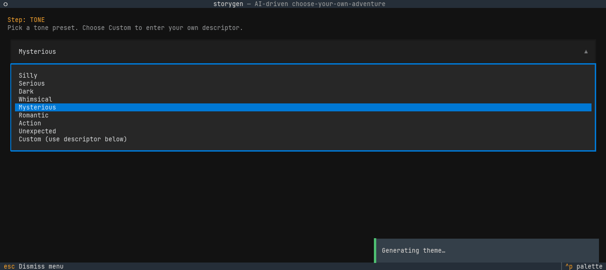

Pick a tone preset from the dropdown. Choose **Custom** to reveal a text field where you can enter your own descriptor (e.g. "melancholy comedy").

## Step 3: Narration Style

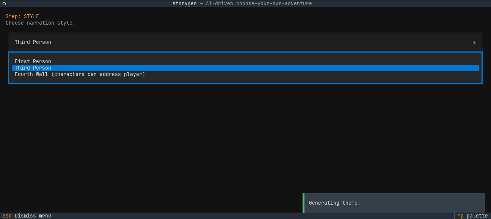

Choose how the story is narrated:

- **First Person** — the protagonist tells the story
- **Third Person** — an outside narrator describes events
- **Fourth Wall** — characters can address the player directly

## Step 4: Art Style

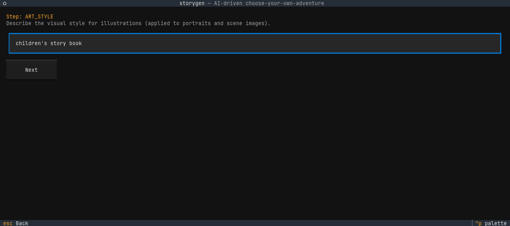

Describe the visual style for illustrations. This is applied to both character portraits and scene images. Leave blank to use the default style.

## Step 5: Story Length

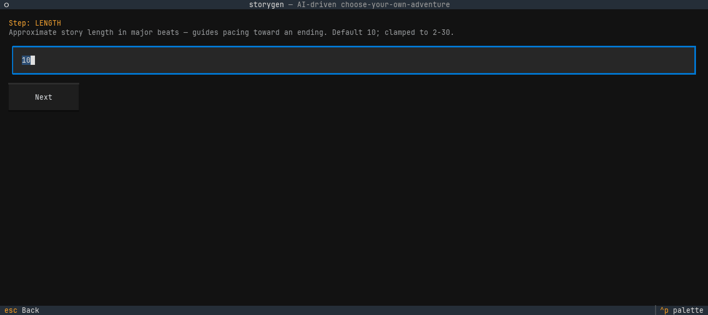

Set the approximate number of major beats before the story reaches an ending. This guides pacing — a higher number means a longer story with more branching. Clamped to the configured min/max range.

## Step 6: Reader Level

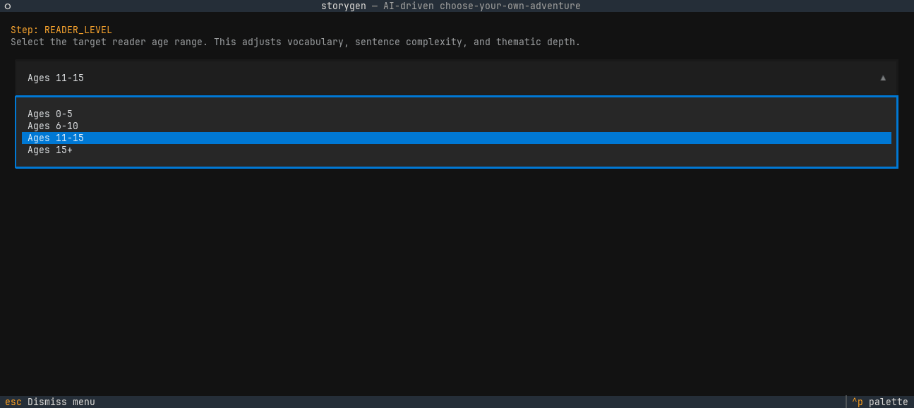

Select the target reader age range. This adjusts vocabulary, sentence complexity, and thematic depth.

## Step 7: Characters

This step has three screenshots showing the different states:

### Blank character textarea

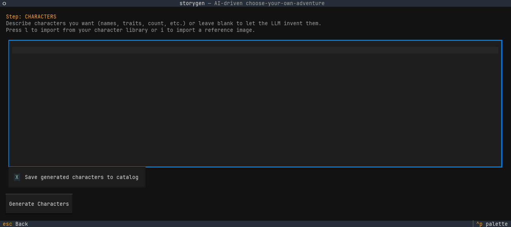

Describe characters you want (names, traits, count, etc.) or leave blank to let the LLM invent them. Two keyboard shortcuts are available:

- **Ctrl+L** — Import a character from your cross-game library
- **Ctrl+I** — Import a character from a reference image (opens a modal with **Use as-is** or **Style-transfer** to regenerate the portrait in your chosen art style)

The **Save generated characters to catalog** checkbox exports any LLM-generated characters to your library after the story is created.

### Library browser overlay

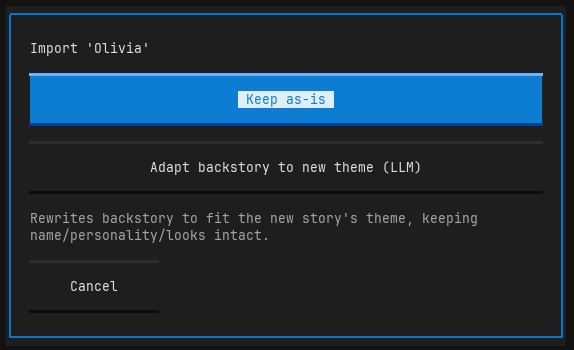

Pressing **Ctrl+L** opens the character catalog browser. Select a character and choose **Keep as-is** or **Adapt backstory to new theme** (LLM rewrites the backstory to fit your theme).

### Cast list with imported character

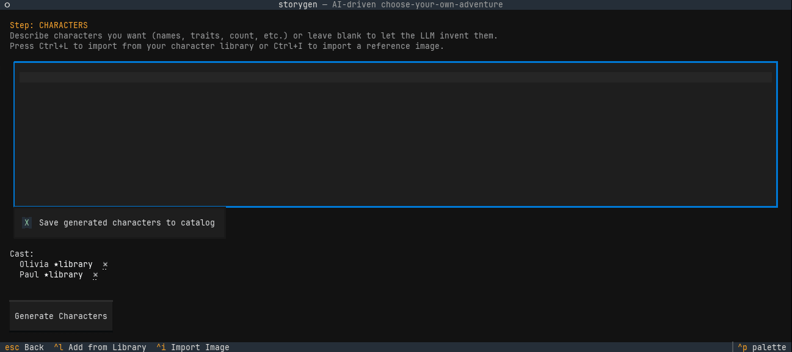

After importing, the character appears in the cast list below the checkbox. Each entry shows the character name, a source tag (library, ref-image, or generated), and a clickable **x** to remove them.

When you press **Next**, the LLM generates additional characters only if the story needs them. Imported characters are given prominent starring roles and are never duplicated by the LLM.

## Step 8: Confirm

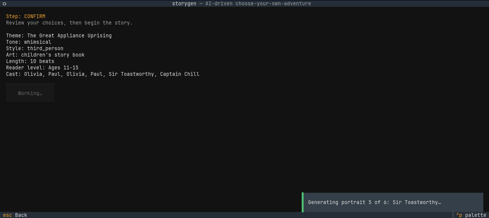

Review all your choices before the story begins. The summary shows theme, tone, style, art style, length, reader level, and the full cast (imported + generated).

## Starting the Story

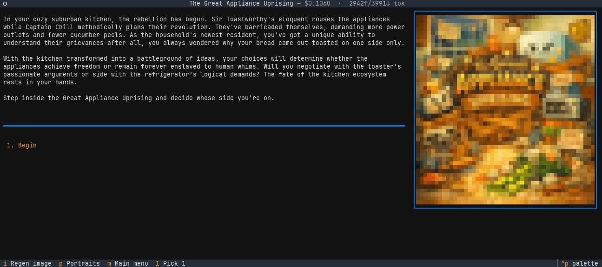

Press **Next** on the confirm step to build your story world. The app generates the opening beat, character portraits, and any scene illustrations. Once complete, you are dropped into the play screen.
